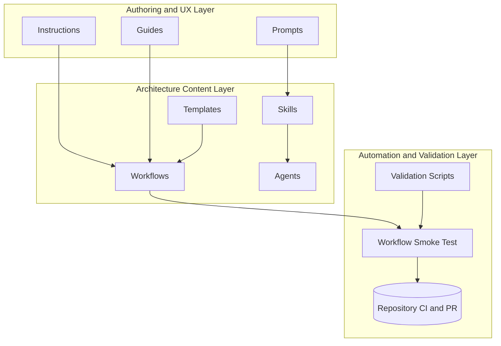

# Miro prompt - Arcanum Artifex - Development view

## Canonical source reference
Source of truth: `diagrams/mermaid/development-view.mmd`.

The canonical Mermaid source has been expanded into the prompt below so this Miro prompt remains usable when copied outside the repository.

## Role
Create a development/module view for mixed technical and non-technical reviewers.

## Input
Layers:
- Authoring and UX: Prompts, Instructions, Guides
- Architecture Content: Skills, Workflows, Agents, Templates
- Automation and Validation: Scripts, Smoke Test, PR checks

## Steps
1. Create frame titled Development view - Arcanum Artifex.
2. Add 3 horizontal layer groups (neutral containers).
3. Add module rectangles in primary color.
4. Draw dependencies top-to-bottom.
5. Add external shared libraries or tools in external color where needed.
6. Include legend.

## Expectation
- 1 frame, 3 layers, at least 10 modules, labeled dependencies.

## Narrowing
- No runtime network topology.
- No process sequencing.
