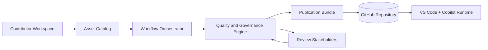

# Miro prompt - Arcanum Artifex - Logical view

## Canonical source reference
Source of truth: `diagrams/mermaid/logical-view.mmd`.

The canonical Mermaid source has been expanded into the prompt below so this Miro prompt remains usable when copied outside the repository.

## Role
You are a senior solutions architect creating a Logical view for Arcanum Artifex for a mixed audience (engineering, governance, and managers).

## Input
System: Repository for standalone Copilot assets (skills, workflows, prompts, instructions, guides).

Key elements (8):
- Contributor Workspace (internal)
- Asset Catalog (internal)
- Workflow Orchestrator (internal)
- Quality and Governance Engine (internal)
- Publication Bundle (internal)
- GitHub Repository (external)
- VS Code + Copilot Runtime (external)
- Review Stakeholders (external actor)

Relationships (9):
- Contributor Workspace -> Asset Catalog: authors content
- Asset Catalog -> Workflow Orchestrator: provides reusable assets
- Workflow Orchestrator -> Quality and Governance Engine: submits for checks
- Quality and Governance Engine -> Publication Bundle: approves packaging
- Publication Bundle -> GitHub Repository: publishes updates
- GitHub Repository -> VS Code + Copilot Runtime: serves assets
- Review Stakeholders -> Quality and Governance Engine: review decisions
- Quality and Governance Engine -> Review Stakeholders: findings and status
- Contributor Workspace -> Workflow Orchestrator: triggers generation

## Steps
1. Create frame titled Logical view - Arcanum Artifex (2400x1400).
2. Add legend top-right with palette semantics and arrow styles.
3. Place 5 internal rounded rectangles in center using primary color.
4. Place 3 external entities around boundary using external color.
5. Draw 9 labeled arrows; solid for sync dependencies and dashed for review loops.
6. Align to grid and avoid crossing arrows.

## Expectation
- 1 frame, 1 legend, 8 labeled entities, 9 labeled arrows.
- Shared semantic palette only.
- Mixed-audience readable labels.

## Narrowing
- No deployment topology.
- No code-level module lists.
- No unlabeled arrows.
