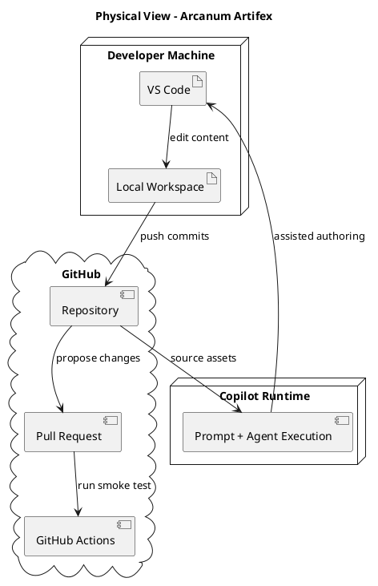

# Miro prompt - Arcanum Artifex - Physical view

Create one clean physical deployment diagram for **Arcanum Artifex**.

## Canonical source reference
Source of truth: `diagrams/mermaid/physical-view.puml`.

The canonical PlantUML source has been expanded into the drawing instructions below so this Miro prompt remains usable when copied outside the repository. Do not parse or render PlantUML in Miro Sidekick; use the drawing instructions instead.

## Must Draw

Draw a landscape frame titled `Physical View - Arcanum Artifex`.

Use **three large vertical background panels** from left to right. These panels are visual grouping containers, not process steps and not BPMN lanes:

1. `Local / Developer Zone`
2. `GitHub Platform Zone`
3. `Copilot Runtime Zone`

Make the three panels equal height, aligned at the top and bottom, and wide enough to contain their child objects. Use light fill, visible borders, and header text at the top of each panel. Send these panels behind all other objects.

Inside the panels, draw these nested boundary containers and components:

| Panel | Boundary container | Components inside the boundary |
|-------|--------------------|---------------------------------|
| `Local / Developer Zone` | `Developer Machine` | `VS Code` above `Local Workspace` |
| `GitHub Platform Zone` | `GitHub` | `Repository` above `Pull Request` above `GitHub Actions` |
| `Copilot Runtime Zone` | `Copilot Runtime` | `Prompt + Agent Execution` |

Use these styles:

| Object type | Shape | Fill | Stroke |
|-------------|-------|------|--------|
| Zone panel | Large rectangle/group with header | `#f5f5f5` | `#666666` |
| GitHub zone panel | Large rectangle/group with header | `#e1d5e7` | `#9673a6` |
| Boundary container | Rectangle/group | `#ffffff` | `#666666` |
| GitHub boundary container | Rectangle/group | `#ffffff` | `#9673a6` |
| Component | Rounded rectangle | `#dae8fc` | `#6c8ebf` |

## Placement

Use this approximate placement. Preserve the relative positions even if exact coordinates are adjusted by Miro:

| Object | x | y | width | height |
|--------|---|---|-------|--------|
| `Local / Developer Zone` | 50 | 90 | 460 | 720 |
| `GitHub Platform Zone` | 570 | 90 | 460 | 720 |
| `Copilot Runtime Zone` | 1090 | 90 | 460 | 720 |
| `Developer Machine` | 120 | 170 | 320 | 300 |
| `GitHub` | 640 | 170 | 320 | 420 |
| `Copilot Runtime` | 1160 | 240 | 320 | 250 |
| `VS Code` | 180 | 240 | 200 | 70 |
| `Local Workspace` | 180 | 360 | 200 | 70 |
| `Repository` | 700 | 230 | 200 | 70 |
| `Pull Request` | 700 | 350 | 200 | 70 |
| `GitHub Actions` | 700 | 470 | 200 | 70 |
| `Prompt + Agent Execution` | 1210 | 335 | 220 | 80 |

## Connectors

Draw **only** these six labeled connectors:

1. `VS Code` -> `Local Workspace`: `edit content`
2. `Local Workspace` -> `Repository`: `push commits`
3. `Repository` -> `Pull Request`: `propose changes`
4. `Pull Request` -> `GitHub Actions`: `run smoke test`
5. `Repository` -> `Prompt + Agent Execution`: `source assets`
6. `Prompt + Agent Execution` -> `VS Code`: `assisted authoring` using a dashed feedback connector routed along the bottom of the frame

Route internal connectors vertically within their boundary containers where possible. Route cross-panel connectors horizontally. Keep connector labels close to their lines and avoid overlapping labels.

## Do Not Draw

- Do not create `Start` or `End` nodes.
- Do not create a legend.
- Do not create `contains` connectors or containment labels.
- Do not connect panels or boundary containers to their child objects.
- Do not use parallelograms, sticky notes, database cylinders, flowchart symbols, data-flow symbols, or mind-map branches.
- Do not add any object that is not listed above.
- Do not collapse the diagram into a single top-to-bottom or left-to-right flow.

## Final Check

The final board must contain exactly:

- 1 titled frame
- 3 large background zone panels
- 3 boundary containers: `Developer Machine`, `GitHub`, `Copilot Runtime`
- 6 component boxes: `VS Code`, `Local Workspace`, `Repository`, `Pull Request`, `GitHub Actions`, `Prompt + Agent Execution`
- 6 labeled connectors

If Sidekick creates anything else, remove it.
