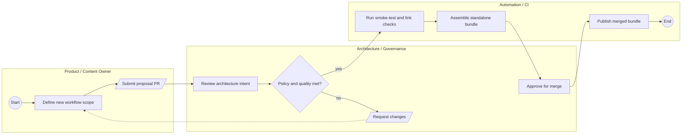

# Miro prompt - Arcanum Artifex - Process view (swimlane)

## Canonical source reference
Source of truth: `diagrams/mermaid/process-view.mmd`.

The canonical Mermaid source has been expanded into the prompt below so this Miro prompt remains usable when copied outside the repository.

## Role
You are a senior architect creating a BPMN-style process view for a mixed audience.

## Input
Flow: idea to published workflow bundle.
Lanes (3): Product and Content, Architecture and Governance, Automation and CI.

Tasks/events/gateways:
- Start event
- User tasks: Define scope, Submit proposal
- Service tasks: Review intent, Validate bundle, Package and publish
- Gateway: Policy and quality met?
- User task: Request changes (feedback loop)
- End event

## Steps
1. Create frame titled Process view - Arcanum Artifex (swimlane) (2400x1400).
2. Create 3 horizontal lanes with neutral background.
3. Place start event (success), end event (error for rejected or terminal path marker where used).
4. Place user tasks in primary color and service tasks in success color.
5. Place gateway in warning color.
6. Draw sequence and feedback arrows with labels.
7. Add legend with shared mapping: user task=primary, service/start=success, gateway=warning, end/error=error.

## Expectation
- 1 frame, 3 lanes, 2 events, 4 service/user tasks, 1 gateway, labeled connectors.

## Narrowing
- No infrastructure nodes.
- No module ownership charts.
