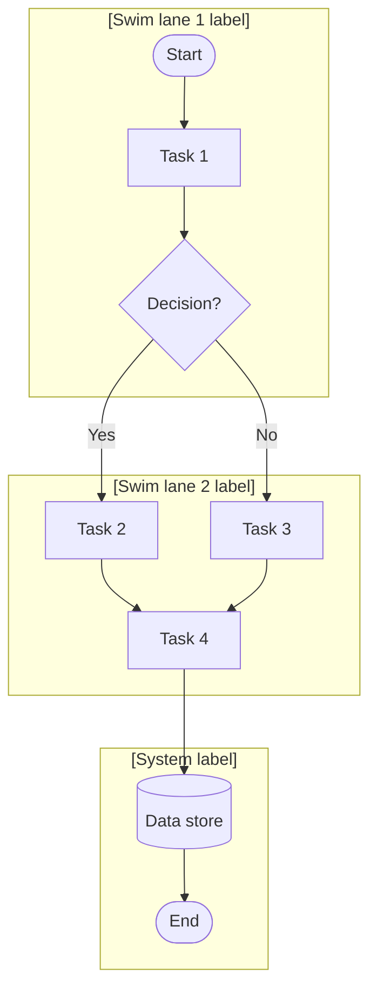

## What this skill does

Produces a structured process map with swim lanes, task nodes, decision diamonds, and handoff arrows. Output is in **Mermaid** flowchart notation (renderable in GitHub, VS Code, Confluence, and Miro) or **BPMN-lite** text when a formal notation is required. It also generates a companion process narrative for documentation.

## When to use it

- User asks to "map a process", "document a workflow", or "draw an AS-IS/TO-BE diagram".
- User needs to identify bottlenecks, redundancies, or handoff gaps in an existing process.
- User is designing a new process and needs a visual spec before implementation.
- User wants to feed the output into a `miro-board` or include it in a `requirements-document`.

## Key concepts

### AS-IS vs. TO-BE

| | AS-IS | TO-BE |
| --- | --- | --- |
| **Purpose** | Document what currently happens, including workarounds and pain points | Define the improved or target process |
| **Annotation** | Mark pain points (⚠), manual steps (M), and system steps (S) | Mark new capabilities (NEW) and removed steps (REMOVED) |
| **Output** | Evidence base for improvement | Specification for change |

### Process map elements

| Element | Notation | Mermaid syntax |
| --- | --- | --- |
| Start / End | Circle | `([Start])` / `([End])` |
| Task / Activity | Rectangle | `[Task name]` |
| Decision | Diamond | `{Decision?}` |
| Sub-process | Double border | `[[Sub-process]]` |
| Data store | Cylinder | `[(Data store)]` |
| Swim lane | Subgraph | `subgraph Actor` |

### Swim lanes

Each actor (person, role, system, or external party) gets its own swim lane. Handoffs occur when an arrow crosses lane boundaries.

## Instructions

1. **Identify the process type.** AS-IS, TO-BE, or both (comparison).

2. **Name the process.** Short, active-verb label (e.g., "Order fulfilment", "User onboarding", "Incident response").

3. **Identify actors.** List all roles, systems, and external parties involved. Each becomes a swim lane.

4. **Elicit process steps.** From the user's description, identify:
   - Tasks (what is done)
   - Decisions (yes/no or multi-path branch points)
   - Handoffs (step passes from one actor to another)
   - Start and end events

5. **Map pain points (AS-IS only).** Note any steps described as slow, manual, error-prone, or unclear. Annotate them in the diagram.

6. **Identify improvements (TO-BE only).** Mark new steps, automated replacements, and removed steps.

7. **Render the Mermaid diagram** following the format below.

8. **Write the process narrative** — a numbered step-by-step description matching the diagram.

## Output format

````markdown
## Process map: [Process name] ([AS-IS / TO-BE])



### Pain points (AS-IS) / Changes (TO-BE)

| Step | Issue / Change | Severity / Type |
| --- | --- | --- |
| [Task name] | [Description] | Pain point / New / Removed / Automated |

### Process narrative

1. **[Actor]** — [Step description].
2. **[Actor]** — [Step description]. If [condition], go to step N.
3. ...

### Handoff summary

| From | To | Trigger |
| --- | --- | --- |
| [Actor] | [Actor] | [What causes the handoff] |
````

## Examples

### Example 1 — AS-IS order fulfilment

**Input:** "Map our current order fulfilment process. Customer places order on website, ops team manually checks stock, emails supplier if out of stock, warehouse picks and packs, courier collects."

**Expected output:** Mermaid diagram with swim lanes for Customer, Ops, Warehouse, Supplier, Courier. Manual email step annotated as pain point. Process narrative with handoff summary.

### Example 2 — TO-BE incident response

**Input:** "Document the new incident response process after we add PagerDuty. Alert fires → PagerDuty pages on-call → engineer acknowledges → triages → resolves or escalates → post-mortem."

**Expected output:** TO-BE diagram with System (monitoring), PagerDuty, On-call Engineer swim lanes. Steps marked NEW where PagerDuty replaces manual paging. Post-mortem step annotated as new capability.

### Example 3 — AS-IS and TO-BE comparison

**Input:** User provides both current and target process descriptions.

**Expected output:** Two Mermaid diagrams side by side, a change summary table listing added, removed, and modified steps, and a narrative explaining the key improvements.

## Notes

- Keep swim lane labels short — they appear as diagram headers.
- Mermaid flowchart direction: `TD` (top-down) for most processes; `LR` (left-right) for linear pipelines.
- If the process has more than 15 steps, consider splitting it into sub-processes and mapping each separately.
- For formal BPMN output (e.g., for Signavio, Camunda, or Visio import), note that Mermaid is BPMN-inspired but not BPMN-compliant. Offer to produce a BPMN XML skeleton if the user needs a tool-importable format.
- This skill pairs directly with `gap-analysis` (map AS-IS first, then identify gaps to reach TO-BE) and `miro-board` (Mermaid diagrams can be embedded in Miro frames).
