# SynthClaim — Logical view

**Audience:** Cross-functional — technology, compliance, claims operations, business sponsor.
**Takeaway:** How SynthClaim decomposes into subsystems and how those subsystems interact with external actors and systems, independently of where any of it runs.
**Version:** 1.0 (2026-04-18)
**Owner:** Solutions architecture
**Last reviewed:** 2026-04-18

---

## 1. Overview

SynthClaim is organised as a set of domain-aligned services behind a unified API edge. Three ingestion adapters (portal, mail, broker API) normalise incoming claims into a single internal format. A document-processing pipeline extracts structured fields from attachments using OCR and ML classification. A claims-lifecycle service drives the decision workflow — auto-approval for low-risk claims, adjudicator review for the rest. The on-premises policy mainframe remains the authoritative source of policy, customer, and payment data; SynthClaim reads from it and writes back decisions rather than duplicating its state.

This view shows the logical decomposition. It deliberately does not show where anything runs (see physical view) or the sequence of interactions at runtime (see process view).

## 2. Scope

**In scope:**
- Internal subsystems owned by SynthClaim
- External systems SynthClaim integrates with, at the logical level
- Human actor types that interact with SynthClaim directly
- The main data stores and their purpose

**Out of scope (covered elsewhere):**
- Deployment topology and cloud infrastructure — see *04-physical-view.md*
- Runtime call sequences, latency, error paths — see *02-process-view.md*
- Code organisation and repositories — see *03-development-view.md*

## 3. Diagram

```mermaid
C4Container
    title SynthClaim — Container view

    Person(policyholder, "Policyholder", "Submits and tracks their claims")
    Person(adjudicator, "Adjudicator", "Reviews and decides on claims that require human judgement")
    Person(auditor, "Auditor / DPO", "Reviews decisions for compliance and responds to regulator requests")

    System_Ext(broker, "Broker API", "Third-party brokers submitting claims on behalf of policyholders")
    System_Ext(mailGateway, "Corporate mail gateway", "Internal mail infrastructure handling email-based intake")
    System_Ext(scanService, "Post-room scan service", "Scans paper mail and delivers as email attachments")

    System_Boundary(synth, "SynthClaim") {
        Container(portal, "Claims Portal", "React / TypeScript", "Browser UI for policyholders to submit and track claims")
        Container(adjuiUi, "Adjudicator Console", "React / TypeScript", "Internal UI for adjudicators to review and decide claims")

        Container(apiEdge, "API Edge", "Kong on ECS", "Single entry point — authN, authZ, rate limiting, TLS termination")

        Container(intake, "Claim Intake Service", "Java / Spring Boot", "Normalises submissions from portal, mail, broker API into internal claim events")
        Container(docPipe, "Document Processing Pipeline", "Python / Airflow", "OCR, text extraction, field detection, document classification")
        Container(classifier, "Claim Classifier", "Python / FastAPI + SageMaker", "ML service that classifies claims (auto-approve / review / refer)")
        Container(lifecycle, "Claims Lifecycle Service", "Java / Spring Boot", "Business workflow — state, routing, escalation, time-bounds")
        Container(decision, "Decision Service", "Java / Spring Boot", "Records and publishes adjudicator / auto-decisions; maintains immutable decision log")
        Container(dsar, "Data Subject Rights Service", "Java / Spring Boot", "Handles GDPR Art. 15/17/20 requests across all internal stores")
        Container(audit, "Audit Log", "Kafka topic + S3 + Athena", "Append-only log of every architecturally significant event")

        ContainerDb(claimsDb, "Claims Datastore", "PostgreSQL", "Transactional state of claims through their lifecycle")
        ContainerDb(docStore, "Document Store", "S3 (encrypted)", "All documents attached to claims — original + OCR output")
        ContainerDb(featureStore, "Feature Store", "S3 + Athena", "Features used by the classifier — both training and inference")
        ContainerDb(modelRegistry, "Model Registry", "SageMaker Model Registry", "Versioned trained models with provenance and metrics")
    }

    System_Ext(mainframe, "Policy Mainframe", "On-premises IBM mainframe — system of record for policy, customer, and payment data")

    Rel(policyholder, portal, "Submits and tracks claims", "HTTPS")
    Rel(adjudicator, adjuiUi, "Reviews and decides", "HTTPS")
    Rel(auditor, dsar, "Issues data-subject requests", "HTTPS")
    Rel(broker, apiEdge, "Submits claim on behalf of policyholder", "REST / mTLS")
    Rel(mailGateway, intake, "Forwards email-based claims", "SMTP/webhook")
    Rel(scanService, mailGateway, "Delivers scanned paper as email")

    Rel(portal, apiEdge, "JSON over HTTPS")
    Rel(adjuiUi, apiEdge, "JSON over HTTPS")
    Rel(apiEdge, intake, "routes to")
    Rel(apiEdge, lifecycle, "routes to")
    Rel(apiEdge, dsar, "routes to")

    Rel(intake, docPipe, "submits documents for processing")
    Rel(docPipe, docStore, "reads/writes document objects")
    Rel(docPipe, classifier, "requests classification")
    Rel(classifier, featureStore, "reads features")
    Rel(classifier, modelRegistry, "loads model")
    Rel(intake, lifecycle, "publishes ClaimSubmitted event")
    Rel(lifecycle, claimsDb, "reads/writes")
    Rel(lifecycle, decision, "requests decision recording")
    Rel(decision, claimsDb, "writes decision state")
    Rel(decision, audit, "publishes DecisionRecorded")
    Rel(lifecycle, mainframe, "reads policy + customer; writes decision outcome", "SOAP/XML over VPN")
    Rel(dsar, claimsDb, "reads across all stores")
    Rel(dsar, docStore, "reads")
    Rel(dsar, audit, "reads")
```

## 4. Components

### Claims Portal
Browser-based single-page application for policyholders. Provides claim submission, tracking, and document upload. Enforces accessibility baseline (WCAG 2.2 AA). Owned by: Digital Customer Experience team.

**Inbound:** HTTPS from policyholders.
**Outbound:** JSON/HTTPS to API Edge.

### Adjudicator Console
Browser-based SPA for internal adjudicators. Presents the claims queue, claim detail with supporting evidence, decision entry, and audit trail. Owned by: Claims Operations Tech team.

**Inbound:** HTTPS from authenticated internal users.
**Outbound:** JSON/HTTPS to API Edge.

### API Edge
Policy enforcement point for all external traffic. Handles TLS termination, authentication (OIDC for humans, mTLS for broker API), authorisation (OAuth2 scopes), and rate limiting. Owned by: Platform Engineering.

### Claim Intake Service
Normalises claims arriving from multiple channels into a single internal `Claim` event. Responsible for:
- Portal submissions — direct JSON
- Mail gateway submissions — parses email + attachments
- Broker API submissions — validates against broker schema, maps to internal format

Emits `ClaimSubmitted` events on the event bus. Does not make any business decisions. Owned by: Intake squad.

### Document Processing Pipeline
Python / Airflow pipeline that:
1. Stores received documents in the document store (encrypted).
2. Runs OCR (for scans and image-based PDFs).
3. Extracts structured fields (claim type, incident date, claimed amount, etc.).
4. Detects and classifies document types (medical report, incident report, invoice).
5. Submits the normalised feature set to the Claim Classifier.

Owned by: Data Engineering squad.

### Claim Classifier
ML service providing classification of claims into: `AUTO_APPROVE`, `ADJUDICATOR_REVIEW`, or `REFER_FOR_INVESTIGATION`. Model version and confidence are recorded with every classification. Confidence below threshold always routes to `ADJUDICATOR_REVIEW` regardless of classification. Owned by: Data Science team.

### Claims Lifecycle Service
The business-workflow engine. Owns the claim state machine (`submitted → classified → under_review → decided → closed` and variants), routing rules, SLA timers, and escalation logic. Integrates with the on-prem mainframe for authoritative policy data. Owned by: Claims Core squad.

### Decision Service
Records decisions — human (adjudicator) or automated (classifier + lifecycle rules). Maintains the decision log as an immutable, append-only structure with decision rationale, model version (if applicable), and the principal who made the decision. Publishes decisions to the audit log and to the mainframe. Owned by: Claims Core squad.

### Data Subject Rights Service
Handles GDPR Art. 15 (access), Art. 17 (erasure), Art. 20 (portability), and Art. 22 (human review of automated decisions). Has a registered reader or writer interface to every other service's data so it can act system-wide. Owned by: Platform Engineering + DPO office.

### Audit Log
A Kafka topic, tiered to S3 for long-term retention, queryable via Athena. Every architecturally significant event goes here. Retention is 7 years per regulatory obligation. Write-only from everywhere except DSAR service and auditor queries. Owned by: Platform Engineering.

## 5. Relationships

| Source | Target | Type | Purpose |
|--------|--------|------|---------|
| Policyholder | Claims Portal | HTTPS | Submit and track claims |
| Adjudicator | Adjudicator Console | HTTPS | Review and decide |
| Broker API | API Edge | REST / mTLS | Submit claim on behalf of policyholder |
| Mail gateway | Claim Intake Service | SMTP/webhook | Forward email-based claims |
| API Edge | Claim Intake Service | sync | Route submissions |
| Claim Intake Service | Document Processing Pipeline | sync + async | Submit docs for processing |
| Document Processing Pipeline | Claim Classifier | sync REST | Request classification |
| Claim Classifier | Model Registry | sync | Load current model |
| Claim Intake Service | Claims Lifecycle Service | async (Kafka) | Publish `ClaimSubmitted` |
| Claims Lifecycle Service | Policy Mainframe | sync SOAP (over VPN) | Read policy, write decision |
| Decision Service | Audit Log | async (Kafka) | Publish `DecisionRecorded` |
| DSAR Service | Claims Datastore, Document Store, Audit Log | sync | Read across all stores |

## 6. Rationale

**Decision:** Separate Intake from Lifecycle.
**Driver:** Maintainability; isolates channel-specific parsing from business workflow.
**Alternatives:** Merged service was considered — rejected because each new channel would touch lifecycle logic.
**Consequences:** Requires an event contract (`ClaimSubmitted`) that survives versioning across both services.

**Decision:** Classifier is a separate service, not a library embedded in Lifecycle.
**Driver:** Fairness / bias monitoring; regulatory auditability (EU AI Act high-risk system).
**Alternatives:** Embedded classifier library — rejected because it makes the decision boundary (where the model output is applied) harder to locate for auditors.
**Consequences:** Adds a network hop in the critical path; mitigated by tight co-location of classifier and lifecycle in the physical view.

**Decision:** Mainframe remains system of record for policy and customer data.
**Driver:** Organisational / legacy constraint; replacement out of scope.
**Alternatives:** Cache / mirror — rejected for authoritativeness reasons (stale decisions risk).
**Consequences:** Hard dependency on mainframe availability; must handle mainframe downtime gracefully (queue decisions, replay when up).

**Decision:** Dedicated DSAR service, not spread across every service.
**Driver:** GDPR compliance; auditability; keeping data-subject-rights logic changeable without touching business services.
**Alternatives:** Each service implements its own DSAR hooks — rejected for maintenance burden and inconsistency risk.
**Consequences:** DSAR service needs data-access privileges that cut across other services' boundaries; mitigated by audited read-only interfaces.

## 7. Concerns

> **Concern (GDPR — data concentration):** Personal data is concentrated in the Claims Datastore and Document Store, with medical information potentially present in the Document Store. This concentration is architecturally sound (easier to audit and restrict) but raises the blast-radius of a compromise of either store. Mitigation: store-level KMS customer-managed keys, strict IAM, and field-level encryption for special-category Art. 9 data (medical) on top of the default at-rest encryption.

> **Concern (GDPR — DSAR completeness):** The DSAR service must be able to produce a complete view of a subject's data across Claims Datastore, Document Store, Audit Log, AND the on-premises mainframe. The mainframe integration is the weakest link — DSAR retrieval from the mainframe is currently a manual ticket process. This must change before go-live.

> **Concern (Security — authZ propagation):** The architecture centralises authentication at the API Edge but relies on downstream services trusting the Edge's authZ decisions. An internal attacker bypassing the Edge (e.g. via a bastion) would have unrestricted access. Mitigation: each downstream service should independently verify the caller's identity via signed JWTs, treating the Edge as untrusted network.

> **Concern (Bias/fairness — classifier as de-facto gatekeeper):** Although the classifier's output is routed to human review below threshold, the threshold is a policy decision that materially affects fairness outcomes. This threshold is not currently architecturally visible — it lives in classifier config. Recommendation: promote the threshold to a first-class governance artefact with change-control workflow and fairness re-evaluation on every change.

> **Concern (Regulatory — EU AI Act):** Claims classifier is a high-risk AI system per EU AI Act. Required architectural elements present: logging, human oversight, version control of models. Required but weakly represented: data-governance evidence for training-data lineage (currently implicit), risk management documentation lifecycle (currently out of architecture). Recommend adding a Model Governance component that centralises these.

## 8. Assumptions

> **Assumption:** The mainframe exposes a synchronous SOAP interface. If it doesn't, or if the interface is message-queue-based, the mainframe integration architecture needs revisiting.

> **Assumption:** Broker API integration uses mTLS at the API Edge. If brokers require OAuth2 instead, the Edge configuration changes but the architecture doesn't.

## 9. Open questions

- **Q1:** Is there a separate component for fraud-investigation hand-off, or does "REFER_FOR_INVESTIGATION" simply mark the claim and stop? Owner: Claims Operations. Deadline: before sprint planning next month. Impact: affects the decision-service contract.
- **Q2:** Does the mainframe currently support real-time decision write-back, or is it batch-only? Owner: Mainframe team. Deadline: this week. Impact: major — determines whether end-to-end latency is achievable.
- **Q3:** Is the Adjudicator Console a thick client or a web app from the users' perspective? Owner: Claims Operations + Digital. Deadline: sprint 0. Impact: affects intake design for the Console → Edge relationship.

## 10. Related views

- **Process view (02):** shows how these components interact in sequence for the main scenarios.
- **Physical view (04):** shows where these components run — cloud region, VPCs, on-prem site.
- **Development view (03):** shows how these components map to repositories and code ownership.
- **Scenarios view (05):** shows end-to-end journeys exercising these components.

## 11. Change log

| Date | Author | Change |
|------|--------|--------|
| 2026-04-18 | Architecture team | Initial version |
