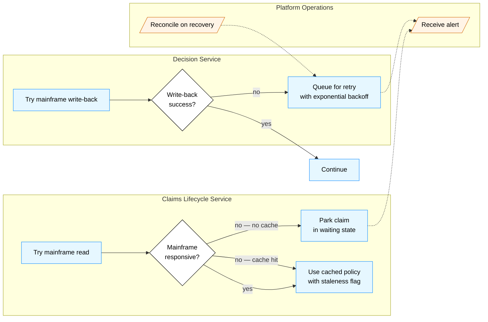

# SynthClaim — Process view

**Audience:** Cross-functional — technology, compliance, claims operations, business sponsor.
**Takeaway:** How claims flow through SynthClaim at runtime, from submission to decision, with the hand-offs between human roles and systems made explicit.
**Version:** 1.0 (2026-04-18)
**Owner:** Solutions architecture + Claims Operations
**Last reviewed:** 2026-04-18

---

## 1. Overview

This view documents three primary runtime flows:

1. **Portal submission with auto-approval** — the happy path for straightforward claims where the classifier's confidence is high and the decision rules allow automation.
2. **Email submission with adjudicator review** — the common path for medium-complexity claims, requiring OCR on attachments and human judgement.
3. **Classifier uncertainty → human review** — an edge path invoked when the classifier's confidence falls below the operational threshold.

Plus two supporting flows:

4. Mainframe-unavailable graceful degradation.
5. Data-subject access request (DSAR).

Cross-functional audience notation: **Mermaid flowchart with swimlane subgraphs** approximating BPMN. Message flow between swimlanes is shown with dashed arrows; sequence flow within a swimlane is solid.

## 2. Scope

**In scope:** Runtime behaviour of the five flows listed above, including their primary failure paths.

**Out of scope (covered elsewhere):**
- The static component structure — see *01-logical-view.md*.
- The deployment topology — see *04-physical-view.md*.
- End-to-end user journeys as narrated scenarios — see *05-scenarios-view.md*.

---

## 3. Process — Portal submission with auto-approval

**Trigger:** Policyholder submits a claim through the portal with supporting documents.

**Outcome (happy):** Claim is approved automatically and the policyholder sees confirmation within 10 minutes.

**Outcome (error):** If any step fails the claim falls through to the "adjudicator review" flow below; the policyholder sees a message that their claim is in review.

### 3.1 Diagram

```mermaid
flowchart LR
    subgraph Policyholder["Policyholder"]
        direction TB
        p_start((Start))
        p_submit[/Submit claim via portal/]
        p_confirm[/See confirmation/]
    end

    subgraph Portal["Claims Portal"]
        direction TB
        port_validate[Validate form & attachments]
        port_upload[Upload documents to S3]
    end

    subgraph Intake["Claim Intake Service"]
        direction TB
        intake_normalise[Normalise to internal event]
        intake_publish[Publish ClaimSubmitted]
    end

    subgraph DocPipe["Document Processing Pipeline"]
        direction TB
        doc_ocr[OCR + field extraction]
        doc_classify[Classify doc types]
    end

    subgraph Classifier["Claim Classifier"]
        direction TB
        cls_score[Score claim]
        cls_gate{Confidence ≥ threshold?}
    end

    subgraph Lifecycle["Claims Lifecycle Service"]
        direction TB
        lc_policy[Read policy from Mainframe]
        lc_rule{Policy allows auto-approve?}
        lc_decide[Auto-approve]
    end

    subgraph Decision["Decision Service"]
        direction TB
        dec_record[Record decision]
        dec_writeback[Write decision to Mainframe]
        dec_audit[Emit DecisionRecorded]
    end

    subgraph Audit["Audit Log"]
        direction TB
        audit_store((Append-only log))
    end

    p_start --> p_submit
    p_submit --> port_validate
    port_validate --> port_upload
    port_upload --> intake_normalise
    intake_normalise --> intake_publish
    intake_publish -.-> doc_ocr
    doc_ocr --> doc_classify
    doc_classify -.-> cls_score
    cls_score --> cls_gate
    cls_gate -->|yes| lc_policy
    cls_gate -->|no| review[Route to adjudicator]
    lc_policy --> lc_rule
    lc_rule -->|yes| lc_decide
    lc_rule -->|no| review
    lc_decide --> dec_record
    dec_record --> dec_writeback
    dec_record --> dec_audit
    dec_audit -.-> audit_store
    dec_record -.-> p_confirm

    classDef userTask fill:#fff4e6,stroke:#d46b08,color:#000
    classDef serviceTask fill:#e6f7ff,stroke:#1890ff,color:#000
    classDef gateway fill:#ffffff,stroke:#000,color:#000
    classDef event fill:#f6ffed,stroke:#52c41a,color:#000

    class p_submit,p_confirm userTask
    class port_validate,port_upload,intake_normalise,intake_publish,doc_ocr,doc_classify,cls_score,lc_policy,lc_decide,dec_record,dec_writeback,dec_audit serviceTask
    class cls_gate,lc_rule gateway
    class p_start,audit_store event
```



### 3.2 Step-by-step narrative

1. Policyholder submits a claim through the portal, attaching supporting documents.
2. Portal validates the form and files (schema, size, type). Documents upload direct-to-S3 with pre-signed URLs; the portal never handles the file bytes.
3. Intake normalises the submission to a `ClaimSubmitted` event and publishes to the event bus. The policyholder gets a 202 and sees a "received" state in under 3 s.
4. Document Processing Pipeline consumes the event, runs OCR and field extraction, classifies document types.
5. Claim Classifier scores the claim, producing a predicted class and a confidence.
6. If confidence < threshold (currently 0.85, managed by governance): route to adjudicator review (flow 5).
7. Lifecycle Service reads the authoritative policy record from the mainframe.
8. Lifecycle applies policy rules: coverage active, within sum insured, claim type allowed, no blocking conditions.
9. If rules pass: Decision Service records the auto-approval; the decision is written back to the mainframe (transactionally with a retry queue if the mainframe is unavailable).
10. A `DecisionRecorded` event is appended to the audit log.
11. The policyholder is notified (email or push) and can see the decision in the portal.

### 3.3 Non-functional properties

| Metric | Target | Notes |
|--------|--------|-------|
| Submission → confirmation | < 3 s at p99 | Synchronous phase only |
| Submission → auto-decision | < 10 min at p99 | End-to-end, excludes mainframe-unavailable degradation |
| Document processing throughput | 1,000 claims/hour per pipeline instance | Horizontal scale |
| Classifier latency | < 500 ms at p99 | Per call to SageMaker endpoint |
| Availability (submission path) | 99.9% | Composite of portal + edge + intake |

### 3.4 Error handling

- Document processing failure: the claim drops to adjudicator review with a flag `intake_processing_failed`; adjudicator sees the raw documents.
- Classifier failure: the claim drops to adjudicator review with a flag `classification_unavailable`.
- Mainframe failure: see flow 6 below (mainframe degradation).
- Decision write-back failure: the decision is durable in the Decision Service; a retry queue attempts write-back; if retries exhaust, the claim is flagged for ops investigation and the policyholder is not notified until the write-back succeeds.

---

## 4. Process — Email submission with adjudicator review

**Trigger:** Policyholder emails a claim to `claims@synthclaim.example` with attachments; or post-room scans paper mail and forwards as email.

**Outcome:** Claim is processed, classified, routed to an adjudicator, decided, and communicated back to the policyholder.

### 4.1 Diagram

```mermaid
flowchart LR
    subgraph Policyholder["Policyholder"]
        direction TB
        p_email[/Email claim<br/>with attachments/]
    end

    subgraph PostRoom["Post-room + Scan Service"]
        direction TB
        scan[Scan paper mail]
        fwd[Forward as email]
    end

    subgraph Mail["Mail Gateway"]
        direction TB
        mg_ingest[Ingest email]
        mg_webhook[Webhook to Intake]
    end

    subgraph Intake["Claim Intake Service"]
        direction TB
        in_parse[Parse email + attachments]
        in_normalise[Normalise to event]
    end

    subgraph DocPipe["Document Processing Pipeline"]
        direction TB
        dp_ocr[OCR + extract]
    end

    subgraph Classifier["Claim Classifier"]
        direction TB
        cls_score[Score]
    end

    subgraph Lifecycle["Claims Lifecycle Service"]
        direction TB
        lc_queue[Place in adjudicator queue]
        lc_policy_read[Fetch policy context]
    end

    subgraph Adjudicator["Adjudicator"]
        direction TB
        adj_pick[/Pick from queue/]
        adj_review[/Review evidence/]
        adj_decide[/Decide approve or reject/]
    end

    subgraph Decision["Decision Service"]
        direction TB
        dec_record[Record decision]
        dec_writeback[Write to Mainframe]
    end

    p_email -.-> mg_ingest
    scan --> fwd
    fwd -.-> mg_ingest
    mg_ingest --> mg_webhook
    mg_webhook --> in_parse
    in_parse --> in_normalise
    in_normalise -.-> dp_ocr
    dp_ocr -.-> cls_score
    cls_score --> lc_queue
    lc_queue --> lc_policy_read
    lc_policy_read -.-> adj_pick
    adj_pick --> adj_review
    adj_review --> adj_decide
    adj_decide --> dec_record
    dec_record --> dec_writeback

    classDef userTask fill:#fff4e6,stroke:#d46b08,color:#000
    classDef serviceTask fill:#e6f7ff,stroke:#1890ff,color:#000

    class p_email,adj_pick,adj_review,adj_decide userTask
    class scan,fwd,mg_ingest,mg_webhook,in_parse,in_normalise,dp_ocr,cls_score,lc_queue,lc_policy_read,dec_record,dec_writeback serviceTask
```



### 4.2 Narrative (concise)

1. Email (direct or from post-room) arrives at mail gateway.
2. Mail gateway webhooks Intake with the raw message + attachments.
3. Intake parses the MIME, extracts body + attachments, and normalises to the internal claim event.
4. Document pipeline OCRs attachments and extracts fields.
5. Classifier scores the claim; in this flow we assume the result routes to human review (either because the classifier says so or because policy doesn't allow auto-approve for this channel / claim type).
6. Lifecycle Service queues the claim with supporting evidence surfaced.
7. An adjudicator picks the claim from the queue.
8. Adjudicator reviews the documents, extracted fields, classifier output (with confidence), and policy context.
9. Adjudicator makes a decision (approve / reject / request-more-information).
10. Decision Service records and writes back.

### 4.3 Non-functional properties

- Queue-pickup to decision: target median 15 min, p95 60 min, hard limit 48 h (beyond which escalation fires).
- Adjudicator sees a full evidence bundle including raw documents, OCR output, extracted fields, and classifier rationale.

### 4.4 Error handling

- Mail parsing failure: the email is preserved unchanged; ops queue is notified; no visible claim is created until resolved.
- Adjudicator inactive (e.g. left the role): queue watchdog reassigns after 30 min of idle "locked" state.

---

## 5. Process — Classifier uncertainty → human review

Flow 3 above, where `cls_gate` evaluates `no`, merges with flow 4 at `lc_queue`. Same narrative from step 6 of flow 4 onwards.

The important architectural property: the classifier never makes a consequential decision alone. Below-threshold outputs route to human review; above-threshold outputs that pass policy rules auto-approve; above-threshold outputs that fail policy rules route to human review. In no path does the model's opinion result in a claim rejection without human judgement.

---

## 6. Process — Mainframe-unavailable graceful degradation

**Trigger:** Mainframe is unavailable (planned maintenance or unplanned outage) when Lifecycle tries to read policy or Decision tries to write back.

### 6.1 Diagram



### 6.2 Narrative

- Lifecycle maintains a bounded-staleness cache of recently-read policy records (TTL 15 min). On mainframe unavailability it uses the cache with an explicit staleness flag in the event; decisions made against stale data are marked and reviewed when the mainframe returns.
- If there's no cache entry and the mainframe is unavailable, the claim is parked in a `waiting_for_policy` state; ops are alerted; the policyholder sees "we're processing your claim". There is no premature decision.
- Decision write-back uses a retry queue. Decisions are durable in the Decision Service regardless of mainframe availability. Reconciliation on recovery replays in order.

### 6.3 Non-functional properties

- Submission path remains available through a mainframe outage.
- Decision latency may exceed target during outage; SLA is suspended for the duration with ops confirmation.

---

## 7. Process — Data-subject access request (DSAR)

**Trigger:** A policyholder or their representative asks for a copy of their data under GDPR Art. 15.

### 7.1 Diagram

```mermaid
sequenceDiagram
    autonumber
    actor Subject as Data subject
    actor DPO as DPO / Auditor
    participant DSAR as DSAR Service
    participant Claims as Claims Datastore
    participant Docs as Document Store
    participant Audit as Audit Log
    participant MF as Mainframe (ticket-based)

    Subject->>DPO: Art. 15 request
    DPO->>DSAR: open DSAR workflow
    DSAR->>Claims: fetch all claim records for subject
    Claims-->>DSAR: records
    DSAR->>Docs: fetch all document metadata + objects
    Docs-->>DSAR: documents
    DSAR->>Audit: fetch all audit entries referencing subject
    Audit-->>DSAR: audit entries
    DSAR->>MF: manual ticket to retrieve mainframe data
    MF-->>DSAR: mainframe records (async, SLA 72h)
    DSAR->>DSAR: assemble structured portable package
    DSAR-->>DPO: package ready
    DPO-->>Subject: deliver package securely
    DSAR-)Audit: log DSAR fulfilment event

    Note over MF: Weakest link — currently ticket-based;<br/>target: automate by end of Q3
```

### 7.2 Narrative

The DSAR service orchestrates retrieval across all internal stores in a single automated flow. The mainframe is the only manual step; closing that gap is the highest-priority DSAR improvement for this quarter. Statutory deadline is 30 days (extendable to 90 for complex requests); the design budget is 5 business days end-to-end.

### 7.3 Non-functional properties

- Automated portion: < 30 minutes.
- End-to-end (including mainframe): < 5 business days target, 30 days hard statutory limit.
- Evidence: every DSAR produces its own audit-log entry recording what was disclosed, to whom, and when.

---

## 8. Rationale (process-level)

**Decision:** Intake emits events rather than calls downstream synchronously.
**Driver:** Scalability (burst handling at peak), resilience (decoupling from downstream failures).
**Consequences:** Requires idempotency in every downstream consumer and a dead-letter pattern.

**Decision:** Classifier routes low-confidence to human review unconditionally.
**Driver:** Fairness, regulatory (EU AI Act human-oversight requirement).
**Consequences:** Operationally: the confidence threshold controls the cost per claim; governance-controlled threshold prevents teams from silently tuning it.

**Decision:** Mainframe write-back is durable-queued rather than synchronous.
**Driver:** Availability — mainframe unavailability must not block decisions.
**Consequences:** Need for reconciliation logic; need to prevent decision drift if the mainframe later rejects a write-back.

## 9. Concerns

> **Concern (GDPR — DSAR mainframe gap):** The mainframe step in DSAR is currently manual. This is a compliance risk: if the mainframe step slips beyond statutory limits, the organisation is in breach. Raise to a programme risk; track closure.

> **Concern (Security — queue poisoning):** The `ClaimSubmitted` event bus is between authenticated boundaries, but a compromise of any producer would let that producer inject arbitrary claims. Mitigation: publisher identity on every event, validated by consumers; per-publisher rate limiting.

> **Concern (Bias/fairness — threshold governance):** The classifier's confidence threshold is an operational setting with significant fairness impact. It must have change-control workflow and be re-evaluated against fairness metrics before any change takes effect.

> **Concern (Regulatory — evidence sufficiency):** Every decision must be reconstructible for 7 years. The audit log is append-only; confirm it includes the exact policy snapshot used, not just a pointer that could be overwritten on the mainframe. Mitigation: at decision time, snapshot the relevant policy data into the audit event.

## 10. Assumptions

> **Assumption:** Mainframe reads are cacheable at 15 min TTL without producing materially stale decisions. This is a claims-policy domain assumption and must be confirmed with the underwriting team.

> **Assumption:** The 0.85 classifier threshold is appropriate. This should be reviewed against operating experience and fairness metrics after go-live.

## 11. Open questions

- **Q4:** What is the SLA for an adjudicator decision once a claim is in the queue? Needed for meaningful end-to-end SLA. Owner: Claims Operations.
- **Q5:** Does the classifier threshold differ by claim type or product? Current assumption: one threshold across all. Owner: Data Science + Risk.
- **Q6:** Does the mainframe provide change notifications, or is all integration polling? If the former, much of the write-back complexity simplifies. Owner: Mainframe team.

## 12. Related views

- **Logical view (01):** defines the components participating in these flows.
- **Physical view (04):** shows where each service runs and how the mainframe-VPN latency shapes these flows.
- **Scenarios view (05):** expands each flow into a named end-to-end scenario with coverage.

## 13. Change log

| Date | Author | Change |
|------|--------|--------|
| 2026-04-18 | Architecture team | Initial version |
