# SynthClaim — Development view

**Audience:** Developers, software managers, platform engineering.
**Takeaway:** How the SynthClaim codebase is organised into repositories and modules, who owns what, and how dependencies flow between them.
**Version:** 1.0 (2026-04-18)
**Owner:** Platform Engineering
**Last reviewed:** 2026-04-18

---

## 1. Overview

SynthClaim uses a polyrepo layout with clear ownership boundaries per repo. A shared-platform repo provides cross-cutting libraries (security, observability, event contracts) that every service consumes. Infrastructure-as-code lives in its own repo, separate from application code, with its own deployment pipeline and approval workflow.

The codebase is layered following a ports-and-adapters (hexagonal) pattern within each service, so that business logic (domain) is independent of channel-specific adapters (web, mail, mainframe).

## 2. Scope

**In scope:** Repositories, modules within repos, cross-repo dependencies, build tooling, code ownership, CI/CD pipeline wiring.

**Out of scope:**
- Runtime components (see *01-logical-view.md*).
- Runtime behaviour (see *02-process-view.md*).
- Deployment topology (see *04-physical-view.md*).

## 3. Diagram

```mermaid
flowchart TB
    subgraph shared["repo: synthclaim-platform (shared libs)"]
        direction LR
        sharedSec[platform-security]
        sharedObs[platform-observability]
        sharedEvents[platform-event-contracts]
        sharedIdent[platform-identity]
        sharedData[platform-data]
    end

    subgraph portal["repo: synthclaim-portal"]
        direction LR
        portalApp[portal-app]
        portalSdk[portal-sdk]
    end

    subgraph console["repo: synthclaim-adjudicator-console"]
        direction LR
        consoleApp[console-app]
    end

    subgraph edge["repo: synthclaim-api-edge"]
        direction LR
        edgeConfig[kong-config]
        edgePlugins[custom-plugins]
    end

    subgraph intake["repo: synthclaim-intake"]
        direction LR
        intakeApi[intake-api]
        intakeDomain[intake-domain]
        intakeAdapters[intake-adapters]
    end

    subgraph lifecycle["repo: synthclaim-lifecycle"]
        direction LR
        lcApi[lifecycle-api]
        lcDomain[lifecycle-domain]
        lcMainframe[mainframe-adapter]
        lcDecision[decision-module]
    end

    subgraph docpipe["repo: synthclaim-docpipe"]
        direction LR
        dpDags[airflow-dags]
        dpOcr[ocr-lib]
        dpExtract[field-extraction]
    end

    subgraph ml["repo: synthclaim-ml"]
        direction LR
        mlTrain[training-pipelines]
        mlServe[inference-service]
        mlEval[evaluation-suite]
        mlRegistry[registry-client]
    end

    subgraph dsar["repo: synthclaim-dsar"]
        direction LR
        dsarApi[dsar-api]
        dsarConnectors[data-connectors]
    end

    subgraph infra["repo: synthclaim-infra"]
        direction LR
        tf[terraform-modules]
        ansible[ansible-playbooks]
        helm[helm-charts]
    end

    portalApp --> portalSdk
    portalSdk --> sharedEvents

    consoleApp --> sharedIdent
    consoleApp --> sharedObs

    edgePlugins --> sharedSec
    edgePlugins --> sharedIdent

    intakeApi --> intakeDomain
    intakeAdapters --> intakeDomain
    intakeApi --> sharedSec
    intakeApi --> sharedObs
    intakeAdapters --> sharedEvents

    lcApi --> lcDomain
    lcMainframe --> lcDomain
    lcDecision --> lcDomain
    lcApi --> sharedSec
    lcApi --> sharedObs
    lcApi --> sharedEvents
    lcApi --> sharedData

    dpDags --> dpOcr
    dpDags --> dpExtract
    dpDags --> sharedObs
    dpDags --> sharedEvents

    mlServe --> mlRegistry
    mlServe --> sharedObs
    mlTrain --> mlEval

    dsarApi --> dsarConnectors
    dsarApi --> sharedSec
    dsarApi --> sharedObs

    tf -.-> intake
    tf -.-> lifecycle
    tf -.-> docpipe
    tf -.-> ml
    tf -.-> dsar
    tf -.-> edge

    classDef sharedLib fill:#e6f7ff,stroke:#1890ff,color:#000
    classDef appRepo fill:#fff4e6,stroke:#d46b08,color:#000
    classDef infraRepo fill:#f9f0ff,stroke:#722ed1,color:#000

    class sharedSec,sharedObs,sharedEvents,sharedIdent,sharedData sharedLib
    class portalApp,portalSdk,consoleApp,edgeConfig,edgePlugins,intakeApi,intakeDomain,intakeAdapters,lcApi,lcDomain,lcMainframe,lcDecision,dpDags,dpOcr,dpExtract,mlTrain,mlServe,mlEval,mlRegistry,dsarApi,dsarConnectors appRepo
    class tf,ansible,helm infraRepo
```



## 4. Modules

### synthclaim-platform (shared libraries)
Owner: Platform Engineering.

| Module | Purpose | Artefact |
|--------|---------|----------|
| `platform-security` | JWT validation, authZ helpers, crypto primitives, pseudonymisation | Java jar + Python wheel |
| `platform-observability` | Metrics, logs, traces — OpenTelemetry wrapper | Java jar + Python wheel |
| `platform-event-contracts` | Schemas for all events on the bus — single source of truth | JSON Schema + generated types |
| `platform-identity` | OIDC integration, principal resolution | Java jar |
| `platform-data` | Common DAO patterns, repository base classes | Java jar |

### synthclaim-portal
Owner: Digital Customer Experience.
React + TypeScript. Uses `@synthclaim/portal-sdk` generated from the event contracts. WCAG 2.2 AA baseline enforced via `axe-core` tests in CI.

### synthclaim-adjudicator-console
Owner: Claims Operations Tech.
React + TypeScript internal console. SSO-backed via `platform-identity`.

### synthclaim-api-edge
Owner: Platform Engineering.
Kong configuration plus custom plugins for claim-specific authZ and rate limiting per broker tenant.

### synthclaim-intake
Owner: Intake squad.
Hexagonal structure:
- `intake-domain` — pure business rules for claim normalisation, no external dependencies.
- `intake-api` — HTTP inbound adapter.
- `intake-adapters` — mail-parsing, broker-API, portal-submission adapters; outbound event-bus publisher.

### synthclaim-lifecycle
Owner: Claims Core squad.
Hexagonal:
- `lifecycle-domain` — claim state machine, policy rules engine.
- `lifecycle-api` — REST + event consumer.
- `mainframe-adapter` — SOAP client + retry queue + cache.
- `decision-module` — decision recording (co-located for transactional consistency with lifecycle state).

### synthclaim-docpipe
Owner: Data Engineering.
Python. Airflow DAGs orchestrating OCR, extraction, and classification calls. Each DAG step is a containerised task.

### synthclaim-ml
Owner: Data Science.
- `training-pipelines` — SageMaker training jobs, hyper-parameter search.
- `inference-service` — FastAPI service behind a SageMaker endpoint.
- `evaluation-suite` — fairness metrics (Fairlearn-based), drift detection, model cards generation.
- `registry-client` — thin wrapper over SageMaker Model Registry.

### synthclaim-dsar
Owner: Platform Engineering + DPO office (co-owned).
Java Spring Boot. Connectors module has one adapter per downstream store.

### synthclaim-infra
Owner: Platform Engineering.
- Terraform modules per logical unit (VPC, each service, RDS, MSK, IAM roles).
- Ansible for on-prem document gateway configuration.
- Helm charts for the docpipe Airflow cluster.

## 5. Cross-cutting concerns

**Logging & tracing:** every service uses `platform-observability` — unified OpenTelemetry exporter, correlation-id propagation, structured JSON logs. No service logs to stdout without going through this library.

**Authentication/authorisation:** every Java service integrates `platform-security`. The rule is: no JWT parsing, no signature verification, no crypto primitive outside `platform-security`. PRs that roll their own crypto are rejected at review.

**Event contracts:** the single source of truth. Every producer and consumer depends on `platform-event-contracts` and is regenerated when schemas change. Contract evolution follows strict compatibility rules (additive only; breaking changes require a new topic version).

**Configuration:** hierarchy — platform defaults → service defaults → environment overrides. Secrets always via AWS Secrets Manager (never in config files or env vars in plaintext).

**Feature flags:** LaunchDarkly, accessed via `platform-observability` client so flag evaluations are traceable.

## 6. Repository structure

Polyrepo by choice, with these drivers:
- Different ownership boundaries → different repositories.
- Different release cadences (portal ships weekly; lifecycle is monthly).
- Different build toolchains (Java vs Python vs TypeScript).
- Regulated components (lifecycle, decision, dsar) under stricter change-control than others.

Each repo has a common top-level layout:
```
.
├── README.md
├── CODEOWNERS
├── .gitlab-ci.yml
├── ARCHITECTURE.md            # link to the relevant sections of these views
├── src/ or app/
├── tests/
├── infra/                     # service-specific IaC that doesn't belong in synthclaim-infra
└── docs/
```

## 7. Build and packaging

| Stack | Build tool | Artefact | Registry |
|-------|-----------|----------|----------|
| Java | Gradle 8 | `*.jar`, OCI image | Nexus (jar), ECR (image) |
| Python | Poetry | `*.whl`, OCI image | Nexus (wheel), ECR (image) |
| TypeScript | pnpm | OCI image (Nginx-served static) | ECR |
| Terraform | Terraform 1.7+ | module source + plan artefacts | Terraform Cloud |
| Helm | Helm 3 | chart tarball | Nexus |

Versioning: semver across libraries, datestamp + build id for services. Every artefact has SBOM generated via Syft and scanned via Grype gate in CI.

## 8. CI/CD pipeline

Each repo → GitLab CI → builds in Jenkins runners → publishes to Nexus/ECR → triggers deployment via ArgoCD (for Kubernetes) or Terraform (for AWS-native).

- **Gate 1 (per-commit):** unit tests, linting, SAST (SonarQube), dependency-vulnerability scan (Grype).
- **Gate 2 (per-PR):** integration tests, SBOM generation, accessibility tests (for front-end), fairness-metric evaluation (for ML repo).
- **Gate 3 (pre-merge):** signed approval from CODEOWNERS; for regulated components, additional sign-off from a member of a separate regulated-change-approval group.
- **Gate 4 (pre-prod):** deployment to staging environment; smoke-test suite; security group diff review.
- **Gate 5 (prod):** canary deployment (5% traffic for 30 min), automated rollback on error-rate spike.

## 9. Concerns

> **Concern (Security — supply chain):** Dependencies are pinned (`gradle.lockfile`, `poetry.lock`, `pnpm-lock.yaml`) and scanned, but we don't currently do provenance attestation on our own artefacts. Move to Sigstore cosign signing in the next quarter; this is a SLSA level-2 gap.

> **Concern (Maintainability — shared-library version drift):** When `platform-*` libraries update, consumers pick up the new version on their next build. In practice, some consumers skip updates for long periods, creating version skew across services. Mitigation: a monthly "platform bump" ceremony, with a dashboard showing platform-library versions in each service.

> **Concern (Regulatory — regulated-vs-non-regulated separation):** All repositories currently share the same CI/CD and deployment infrastructure. An auditor scoping to regulated components will end up examining non-regulated pipeline code too. Mitigation: consider a dedicated regulated-pipeline account for `synthclaim-lifecycle`, `synthclaim-decision`, `synthclaim-dsar`, `synthclaim-ml`.

## 10. Assumptions

> **Assumption:** Polyrepo remains the right choice at this scale. If the org grows significantly, monorepo for shared-platform + services may become more practical; revisit at 30+ services.

## 11. Open questions

- **Q7:** Should the ML evaluation suite live in a separate repo for clearer audit scope, or remain part of `synthclaim-ml`? Owner: Data Science + Compliance.
- **Q8:** Do we need per-broker plugin code in the API Edge, or can it be declarative configuration only? Owner: Platform Engineering.

## 12. Related views

- **Logical view (01):** the modules map to logical components.
- **Physical view (04):** where the artefacts are deployed.
- **Scenarios view (05):** which scenarios exercise which modules.

## 13. Change log

| Date | Author | Change |
|------|--------|--------|
| 2026-04-18 | Architecture team | Initial version |
