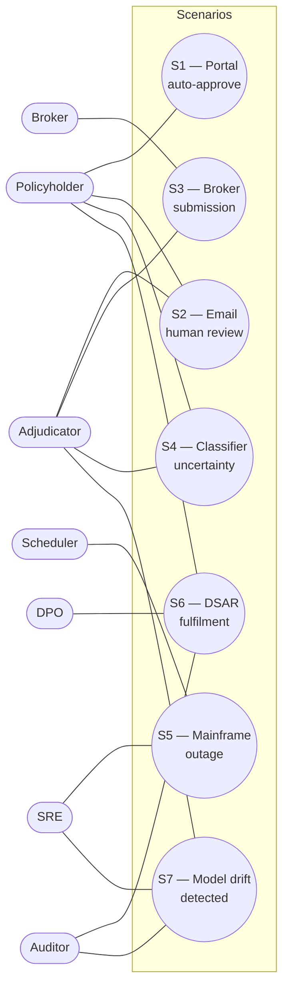
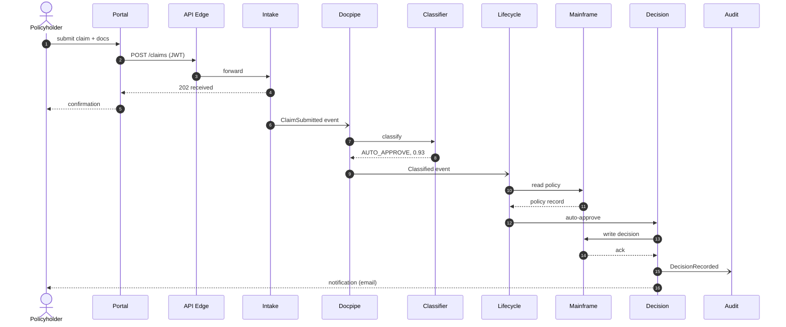
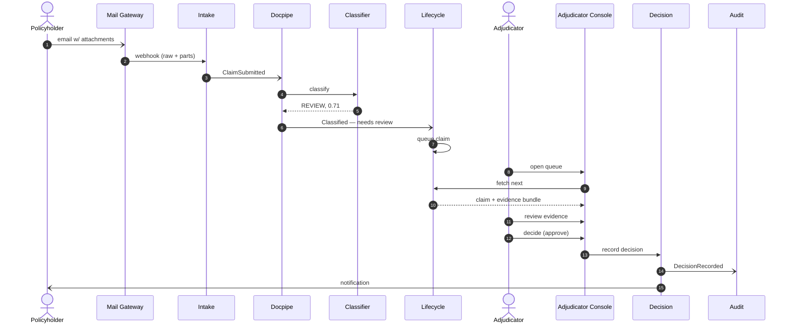
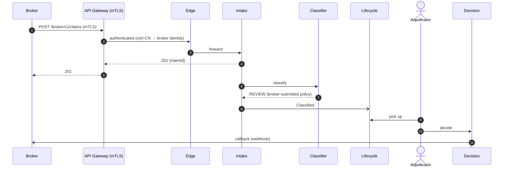
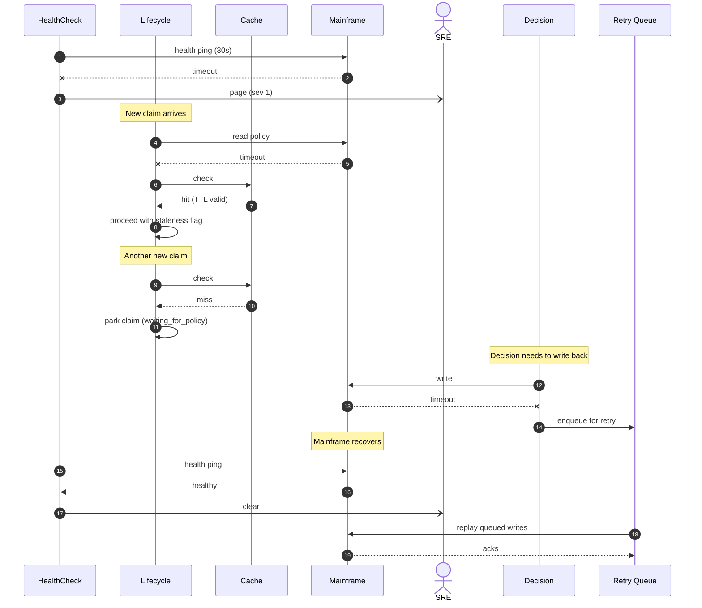
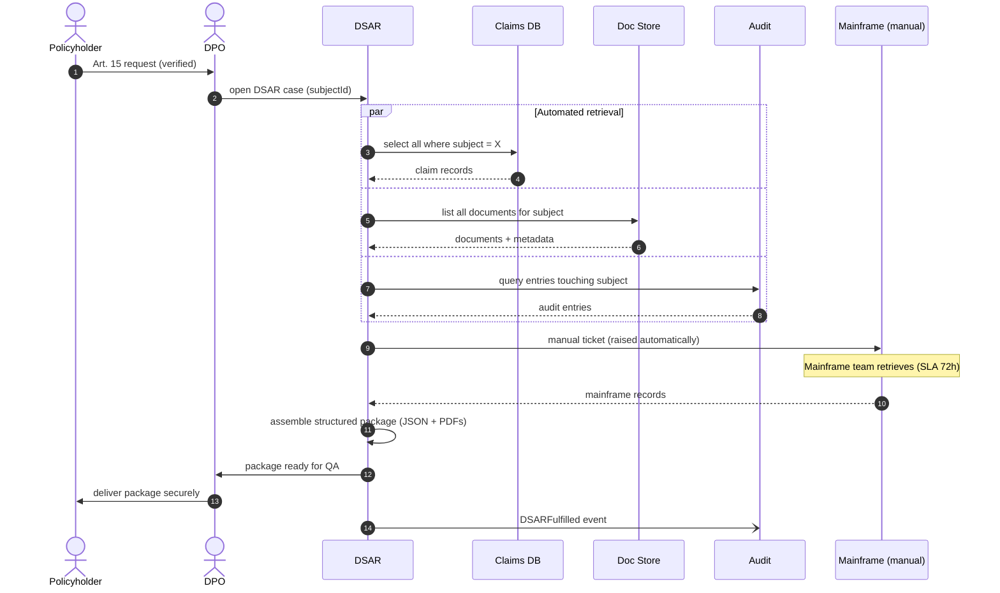
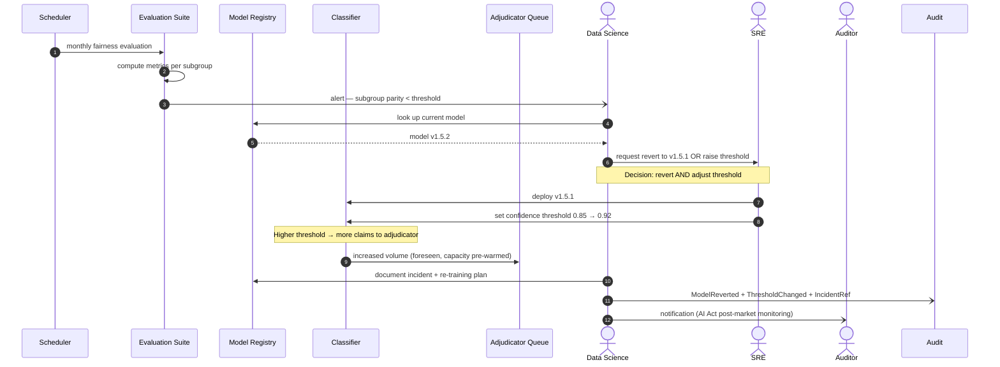

# SynthClaim — Scenarios (+1) view

**Audience:** All stakeholders.
**Takeaway:** A curated set of end-to-end scenarios that collectively exercise every major component, deployment zone, and concern. Read this view first if you want to understand how SynthClaim actually works.
**Version:** 1.0 (2026-04-18)
**Owner:** Solutions architecture
**Last reviewed:** 2026-04-18

---

## 1. Overview

Seven scenarios are documented, covering happy-path, edge-case, failure, operational, and regulatory / compliance situations. Each scenario names the actors involved, the components exercised, the preconditions, and the outcome. The coverage matrix at the end maps scenarios to components and shows no orphan coverage.

## 2. Scope

**In scope:** Seven named end-to-end scenarios and the coverage matrix mapping them to components in the logical view.

**Out of scope:**
- Static decomposition (see *01-logical-view.md*).
- Per-flow runtime detail (see *02-process-view.md*).

## 3. Actor catalogue

| Actor | Type | Role |
|-------|------|------|
| Policyholder | Human (external) | Person with an active policy who submits a claim |
| Broker | System (external) | Third party submitting claims on behalf of a policyholder |
| Adjudicator | Human (internal) | Reviews and decides claims requiring judgement |
| DPO | Human (internal) | Data Protection Officer responsible for Art. 15/17/22 requests |
| Auditor | Human (internal or external) | Compliance / regulator-facing audit |
| SRE | Human (internal) | Responds to incidents and performs operational tasks |
| Scheduler | System (internal) | Time-triggered batch jobs |
| Mainframe team | Human (internal) | Operates the on-prem system of record |

## 4. Use-case overview diagram

## 5. Scenarios

### S1 — Portal submission, auto-approved (happy path)

- **Category:** Happy
- **Trigger:** Policyholder submits a claim via the portal with supporting documents.
- **Actors:** Policyholder
- **Preconditions:** Policy active; claim type supported; documents within size limits; portal available.
- **Postconditions (success):** Claim auto-approved, recorded in mainframe, policyholder notified, audit entry appended.
- **Postconditions (failure):** Falls through to S2 (adjudicator review) with appropriate flag.

**Views exercised:** logical (Portal, Intake, Docpipe, Classifier, Lifecycle, Decision, Audit, Mainframe); process (flow 1); physical (portal CDN, ECS services, SageMaker, RDS, mainframe VPN); development (portal repo, intake, docpipe, ml, lifecycle, decision).

---

### S2 — Email submission requiring adjudicator review (happy-ish path)

- **Category:** Happy (majority path)
- **Trigger:** Policyholder emails a claim with scanned attachments to the claims address.
- **Actors:** Policyholder, Adjudicator
- **Preconditions:** Mail gateway operational; adjudicator on shift.
- **Postconditions:** Claim decided by adjudicator, communicated to policyholder, audit entry recorded.

**Views exercised:** logical (Mail Gateway, Intake, Docpipe, Classifier, Lifecycle, Adjudicator Console, Decision, Audit); process (flow 2); physical (mail-VPN path, ECS services); development (portal-sdk, adjudicator-console, intake, docpipe, ml, lifecycle, decision).

---

### S3 — Broker submits via API on behalf of policyholder

- **Category:** Happy (alternative channel)
- **Trigger:** Broker system submits a claim via the broker API endpoint.
- **Actors:** Broker (system), Adjudicator (typically — broker-submitted claims default to review)
- **Preconditions:** Broker onboarded with mTLS certificate; policyholder consent recorded on broker side.
- **Postconditions:** Claim decided, broker notified via callback, policyholder informed.

**Views exercised:** logical (API GW, Edge, Intake, Classifier, Lifecycle, Adjudicator, Decision); process (flow 2 variant); physical (API Gateway, mTLS, VPC Link to Edge); development (edge plugins, intake).

---

### S4 — Classifier uncertainty routes to human review

- **Category:** Edge
- **Trigger:** A submitted claim scores below the confidence threshold.
- **Actors:** Policyholder, Adjudicator
- **Preconditions:** Classifier operational; claim submitted.
- **Postconditions:** Claim routed to adjudicator without the classifier's output being treated as authoritative; adjudicator sees the low confidence prominently.

This scenario is an important architectural boundary: it proves that the classifier never auto-decides when it shouldn't. The diagram is the same as S2 from `Docpipe → Classifier` onwards, with the addition that the adjudicator console **must** show the classifier's confidence and highlight that it was below threshold.

**Key acceptance criterion:** the adjudicator console tests include a snapshot test showing the "low-confidence banner" rendering.

**Views exercised:** logical (same as S2); process (flow 3); physical (same as S2); development (ml evaluation-suite for threshold governance, adjudicator-console for banner).

---

### S5 — Mainframe outage — graceful degradation

- **Category:** Failure
- **Trigger:** Mainframe becomes unreachable (planned maintenance window overruns).
- **Actors:** SRE, Scheduler (auto-detection)
- **Preconditions:** Mainframe had been healthy; cache may or may not be populated for a given claim.
- **Postconditions:** Submission path remains available; decision path uses cache where valid; new claims without cache entries are parked; SRE paged.

**Views exercised:** logical (Lifecycle, Decision, Mainframe, Audit); process (flow 4); physical (VPN, mainframe; SRE tools); development (mainframe-adapter in lifecycle repo).

---

### S6 — Data-subject access request (DSAR)

- **Category:** Regulatory / compliance
- **Trigger:** Policyholder submits Art. 15 GDPR request via customer services.
- **Actors:** Policyholder, DPO, Auditor (periodic review of DSAR evidence)
- **Preconditions:** Request validated (identity verified); statutory clock starts.
- **Postconditions:** Complete portable package delivered to subject within statutory deadline; every disclosure logged.

**Views exercised:** logical (DSAR, Claims DB, Doc Store, Audit, Mainframe); process (flow 5); physical (all data stores, mainframe); development (dsar repo).

---

### S7 — Model drift detected

- **Category:** Operational / AI governance
- **Trigger:** Monthly fairness-metric evaluation shows demographic parity on one subgroup has dropped below the governance threshold.
- **Actors:** Data Science, SRE, Adjudicator (future, if retraining affects queue behaviour), Auditor (for regulatory record)
- **Preconditions:** Evaluation suite runs on a schedule; threshold-breach alerting configured.
- **Postconditions:** Model temporarily reverted or threshold adjusted; re-training triggered; documentation updated; audit entry recorded.

**Views exercised:** logical (Classifier, Model Registry, Evaluation, Adjudicator Queue, Audit); physical (SageMaker, ECS Docpipe for queue); development (ml repo evaluation-suite, registry-client).

---

## 6. Coverage matrix

| Component (logical view) | S1 | S2 | S3 | S4 | S5 | S6 | S7 |
|--------------------------|:--:|:--:|:--:|:--:|:--:|:--:|:--:|
| Claims Portal             | ✓  |    |    | ✓  |    | ✓  |    |
| Adjudicator Console       |    | ✓  | ✓  | ✓  |    |    | ✓  |
| API Edge                  | ✓  | ✓  | ✓  | ✓  |    | ✓  |    |
| Claim Intake Service      | ✓  | ✓  | ✓  | ✓  |    |    |    |
| Document Processing Pipeline | ✓ | ✓ | ✓  | ✓  |    |    |    |
| Claim Classifier          | ✓  | ✓  | ✓  | ✓  |    |    | ✓  |
| Claims Lifecycle Service  | ✓  | ✓  | ✓  | ✓  | ✓  |    |    |
| Decision Service          | ✓  | ✓  | ✓  | ✓  | ✓  |    |    |
| Data Subject Rights Svc   |    |    |    |    |    | ✓  |    |
| Audit Log                 | ✓  | ✓  | ✓  | ✓  | ✓  | ✓  | ✓  |
| Claims Datastore          | ✓  | ✓  | ✓  | ✓  | ✓  | ✓  |    |
| Document Store            | ✓  | ✓  | ✓  | ✓  |    | ✓  |    |
| Feature Store             | ✓  | ✓  | ✓  | ✓  |    |    | ✓  |
| Model Registry            | ✓  | ✓  | ✓  | ✓  |    |    | ✓  |
| Policy Mainframe          | ✓  | ✓  | ✓  |    | ✓  | ✓  |    |
| Mail Gateway              |    | ✓  |    |    |    |    |    |
| Broker API                |    |    | ✓  |    |    |    |    |

**Gaps:** every component appears in at least one scenario — good coverage.

## 7. Rationale

Scenarios were selected to exercise:
- Every ingress channel (portal, email, broker API).
- The main classifier-output branches (auto-approve, adjudicator, the boundary between them).
- The most consequential failure mode (mainframe outage).
- The regulatory edge (DSAR, AI Act model drift).

Failure and operational scenarios are over-represented relative to a "naive" scenarios list — this is deliberate. Scenarios where nothing goes wrong are cheap to design for; scenarios where things go wrong are where the architecture earns its keep.

## 8. Concerns

> **Concern (GDPR — scenario completeness):** S6 covers Art. 15 (access). We do not yet have an explicit scenario for Art. 17 (erasure) or Art. 22 (right to human review of automated decision). Art. 22 is partly covered by S4 (low-confidence routing) but the explicit "request to review an auto-approved decision" path is not modelled. Add scenarios in next revision.

> **Concern (Security — attack scenario absence):** No scenario covers an adversarial input or a credential-compromise recovery. Add an "S8 — credential compromise" scenario covering: detection of compromised service-account credentials, rotation, audit-log reconstruction of activity during the window of compromise.

> **Concern (Operational — disaster recovery test):** No scenario covers DR failover end-to-end. Operationally this is a runbook; architecturally it's worth including a scenario to ensure the architecture supports it (it does; exercise it).

## 9. Assumptions

> **Assumption:** Statutory DSAR deadline (30 days) is met in practice; our 5-day internal target is adequate.
> **Assumption:** Monthly fairness-evaluation cadence is adequate for the risk profile; this should be reviewed after go-live.

## 10. Open questions

- **Q12:** Should Art. 17 (erasure) and Art. 22 (human review) each have a dedicated scenario? Owner: DPO + Architecture.
- **Q13:** Add a credential-compromise scenario (S8)? Owner: Security.
- **Q14:** Add a DR-failover scenario (S9)? Owner: SRE.

## 11. Related views

- **Logical view (01):** components in the coverage matrix.
- **Process view (02):** the runtime flows these scenarios instantiate.
- **Physical view (04):** deployment elements these scenarios exercise.

## 12. Change log

| Date | Author | Change |
|------|--------|--------|
| 2026-04-18 | Architecture team | Initial version |
