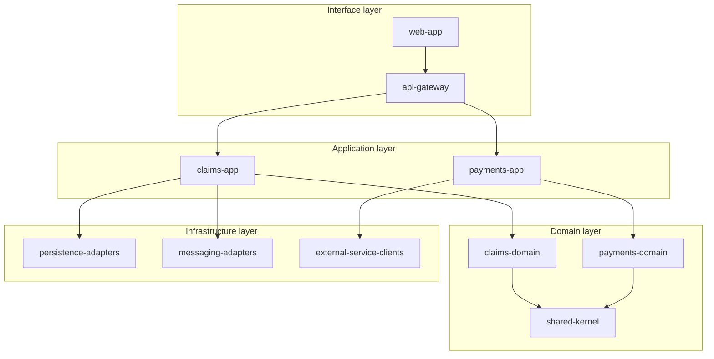
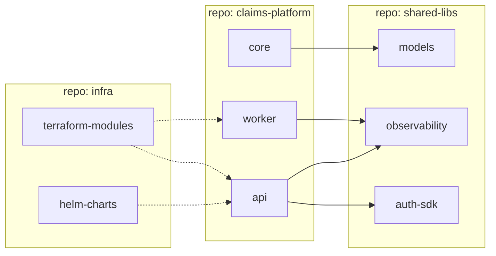

# Development view — reference

**Purpose:** Describe how the software is organised as code. What are the modules, packages, or repositories? How are they layered? What are the dependencies between them?

**Audience:** Developers, software managers, people onboarding to the codebase. This view answers *"where do I find / put code for X?"* and *"what depends on what?"*

## What belongs in the development view

- **Modules / packages / repositories** — the units developers actually work in.
- **Layering** — domain, application, infrastructure, interface — whichever layering the team uses.
- **Dependencies** — which modules depend on which. Directionality matters; circular deps are a smell.
- **Shared libraries / SDKs** — internal ones the modules pull in.
- **Build / deployment artefacts** — jars, wheels, container images, Terraform modules.
- **Code ownership boundaries** — which team owns which modules.

## What does NOT belong in the development view

- Runtime components (that's logical).
- Runtime behaviour (that's process).
- Where artefacts run in production (that's physical).

## Audience routing

### Audience (a) — Dev-only
Use **Mermaid flowchart with subgraphs for layers** or **C4 Component diagram**. Show:
- Modules as boxes, grouped by layer via subgraphs
- Dependency arrows (with direction — who imports whom)
- Build artefacts (jar, wheel, image) as distinct shapes if relevant
- Repository boundaries as outer subgraphs if multiple repos

### Audience (b) — Cross-functional
Use **Mermaid flowchart with subgraphs** at a coarser granularity. Show:
- Bounded contexts / domain modules (not individual packages)
- Shared platform modules separately
- Code ownership overlay (team name as a label on each subgraph)

Skip implementation-specific framework names unless the audience needs them.

### Audience (c) — Executive
**Usually skip the development view entirely for executives** — it's rarely the right level of detail for them. If they specifically ask, give a one-page summary: number of repositories, main language / framework split, team ownership map. No diagram needed.

## Structure of the development view document

Follow `templates/view-template.md`. Development-view-specific sections:

1. **Audience and takeaway**
2. **Layering model** — which layering does this codebase use? (hexagonal, onion, clean, layered, ports-and-adapters, etc.)
3. **Diagram** — Mermaid source
4. **Modules** — one subsection per module. For each:
   - Name
   - Layer
   - Responsibility (1–2 sentences)
   - Key dependencies (inbound and outbound)
   - Owning team (if known)
   - Build artefact type (jar, wheel, container, npm package)
5. **Shared / cross-cutting concerns** — logging, auth, tracing, config. Where do they live?
6. **Repository structure** — monorepo or polyrepo? How are repositories scoped? Where does the CI/CD config live?
7. **Build and packaging** — build tool (Maven, Gradle, Poetry, pnpm, Cargo, etc.), artefact registry, versioning strategy.
8. **Concerns** — for the development view:
   - **Security**: dependency-vulnerability management, SBOM generation, licence compliance
   - **Maintainability**: dependency direction (are there cycles?), test coverage expectations, code-review policy
   - **Supply chain**: provenance of third-party dependencies, lockfile hygiene
9. **Assumptions**
10. **Open questions**

## Mermaid starter template (layered flowchart)

## Mermaid starter template (multi-repo view)

## Miro prompt structure

For the development view, the Miro prompt **Steps** must specify:
- Horizontal or vertical layering (pick one, typically top-to-bottom for hierarchical layers)
- Exact module-box count per layer
- Dependency arrow style (solid with direction)
- Colour per layer (use the same colours consistently across all views)
- Team ownership annotations (as small labels below each module, or in a legend)

**Narrowing** should exclude: runtime behaviour, deployment topology, the other views' content.

See `examples/synth-claim/miro-prompts/development-view-prompt.md` for a fully-worked example.

## Common mistakes to avoid

- **Conflating modules with components.** A component is a runtime thing (logical view); a module is a code-organisation thing (this view). They don't have to be 1:1. Flag deliberately if they're different.
- **Showing every single package.** Stop at the level the reader can hold in their head — typically 8–15 modules per diagram. Subdivide only if needed.
- **Forgetting direction.** Dependency arrows must have direction; undirected lines are meaningless here.
- **No build / packaging info.** Missing this means the view doesn't actually help someone ship the code.
- **Ignoring ownership.** In larger orgs, ownership-per-module is often the most useful piece of information on the diagram.
