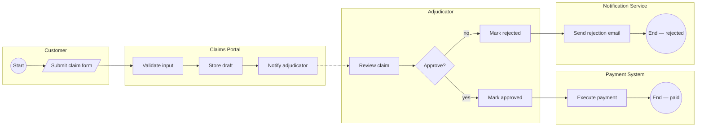
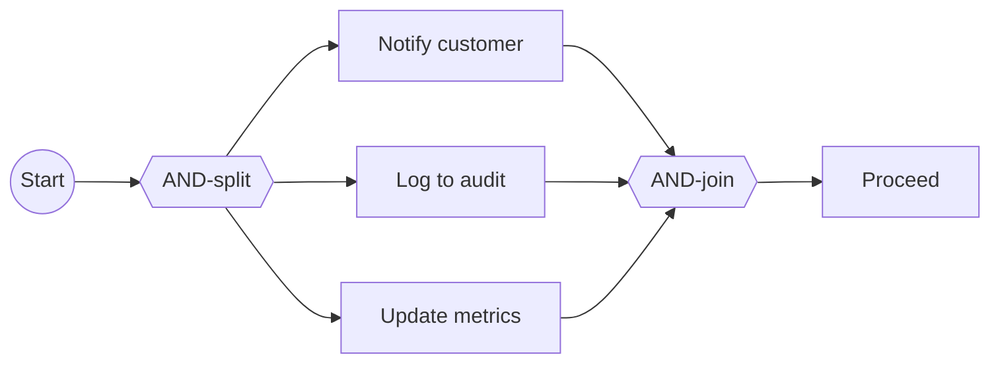
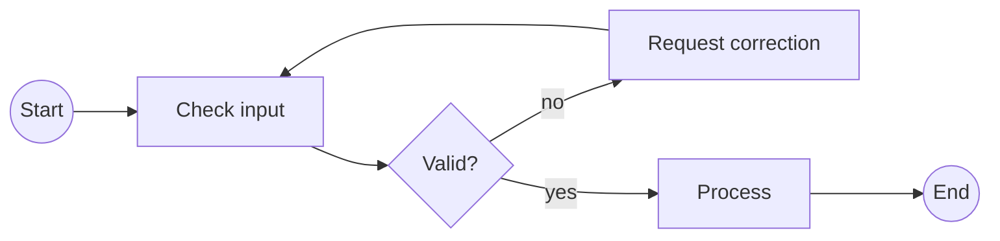

# BPMN-style swimlanes in Mermaid

Mermaid doesn't support true BPMN 2.0. For cross-functional process views, we approximate BPMN using Mermaid `flowchart` with subgraphs as swimlanes. This covers ~80% of BPMN use cases and renders everywhere Mermaid renders.

For the remaining 20% (event-subprocess, compensating transactions, full message correlation), push to a real BPMN tool — bpmn.io or Camunda Modeller — and embed the resulting `.png` / `.svg` alongside the Mermaid source.

## When "Mermaid swimlane" is enough

- Happy-path business processes with human + system actors
- Processes with clear hand-offs between roles
- Processes with a handful of gateways (exclusive / parallel)
- Message flow between a couple of participants

## When you need real BPMN

- Event-driven subprocesses (BPMN's boundary events, timer events, error events)
- Compensation flows
- Call activities invoking formally-modelled subprocesses
- Processes where the diagram is the spec (e.g. Camunda-executable BPMN)

If in doubt, start with Mermaid. You can always upgrade later; the inverse (from BPMN to Mermaid) loses information.

## Core pattern — swimlanes as subgraphs



**Key choices:**
- `flowchart LR` puts swimlanes side-by-side horizontally; each subgraph contains `direction TB` to stack its nodes vertically.
- Alternative: `flowchart TB` with `direction LR` inside subgraphs gives horizontal lanes (more BPMN-like but consumes more vertical space).

## BPMN shape equivalents in Mermaid

| BPMN shape | Mermaid syntax | Meaning |
|------------|----------------|---------|
| Start event | `A((Start))` | Process start |
| End event | `A((End))` | Process end |
| Intermediate event | `A((label))` | Timer, message, error event |
| Task / activity | `A[Task name]` | Atomic step |
| User task | `A[/User task/]` | Human-performed |
| Service task | `A[[Service task]]` | System-performed |
| Subprocess | `A[[Subprocess]]` | Collapsed subprocess (link to its own diagram) |
| Exclusive gateway (XOR) | `A{Decision?}` | Branching on a condition |
| Parallel gateway (AND) | `A{{Parallel}}` | Fork or join |
| Data object | `A[(Data)]` | Data input / output |

Colour-code by shape type using `classDef` to reinforce BPMN semantics:

```
classDef userTask fill:#fff4e6,stroke:#d46b08
classDef serviceTask fill:#e6f7ff,stroke:#1890ff
classDef gateway fill:#fff,stroke:#000
classDef event fill:#f6ffed,stroke:#52c41a

class c_submit userTask
class p_validate,p_store,p_notify,pay_exec serviceTask
class a_decide gateway
class c_start,pay_end event
```

## Message flow vs sequence flow

BPMN distinguishes:
- **Sequence flow** — solid arrow, within a single pool/lane, ordered
- **Message flow** — dashed arrow, between pools/lanes, represents a message being sent

In Mermaid:
- Sequence flow: `A --> B`
- Message flow: `A -.-> B`

The dashed arrow from `p_notify` to `a_review` above is a message flow — the Portal is telling the Adjudicator something.

## Parallel gateway example



## Exclusive + loop example



## Limitations of this approximation — be honest with the reader

When using Mermaid-swimlane for BPMN, state these caveats in the view doc:

- "This diagram approximates BPMN. Message correlation, boundary events, and compensation are not shown. For the executable process model, see [link to BPMN source]."
- "Swimlanes here map to BPMN pools/lanes but are not visually distinguished in all Mermaid renderers. Lane colour coding is applied via `classDef`."

## When the user explicitly wants bpmn.io / Camunda output

- Produce a BPMN 2.0 XML file describing the process. Reference: https://github.com/bpmn-io/bpmn-js
- Recommend the user open it in https://demo.bpmn.io/ or Camunda Modeller to edit visually.
- Still produce the Mermaid version alongside for readability in code reviews and Markdown documents.

BPMN XML starter skeleton (the user can import this into bpmn.io):

```xml
<?xml version="1.0" encoding="UTF-8"?>
<bpmn:definitions xmlns:bpmn="http://www.omg.org/spec/BPMN/20100524/MODEL"
                   xmlns:bpmndi="http://www.omg.org/spec/BPMN/20100524/DI"
                   xmlns:dc="http://www.omg.org/spec/DD/20100524/DC"
                   xmlns:di="http://www.omg.org/spec/DD/20100524/DI"
                   id="Definitions_1"
                   targetNamespace="http://bpmn.io/schema/bpmn">
  <bpmn:process id="Process_claim" isExecutable="false">
    <bpmn:startEvent id="StartEvent_1" name="Claim submitted"/>
    <bpmn:task id="Task_validate" name="Validate claim"/>
    <bpmn:exclusiveGateway id="Gateway_1" name="Valid?"/>
    <bpmn:task id="Task_store" name="Store claim"/>
    <bpmn:task id="Task_reject" name="Reject"/>
    <bpmn:endEvent id="EndEvent_stored" name="Stored"/>
    <bpmn:endEvent id="EndEvent_rejected" name="Rejected"/>
    <bpmn:sequenceFlow id="Flow_1" sourceRef="StartEvent_1" targetRef="Task_validate"/>
    <bpmn:sequenceFlow id="Flow_2" sourceRef="Task_validate" targetRef="Gateway_1"/>
    <bpmn:sequenceFlow id="Flow_3" sourceRef="Gateway_1" targetRef="Task_store" name="yes"/>
    <bpmn:sequenceFlow id="Flow_4" sourceRef="Gateway_1" targetRef="Task_reject" name="no"/>
    <bpmn:sequenceFlow id="Flow_5" sourceRef="Task_store" targetRef="EndEvent_stored"/>
    <bpmn:sequenceFlow id="Flow_6" sourceRef="Task_reject" targetRef="EndEvent_rejected"/>
  </bpmn:process>
</bpmn:definitions>
```

Suggest the user open in https://demo.bpmn.io/ to lay out and add pools/lanes visually.
