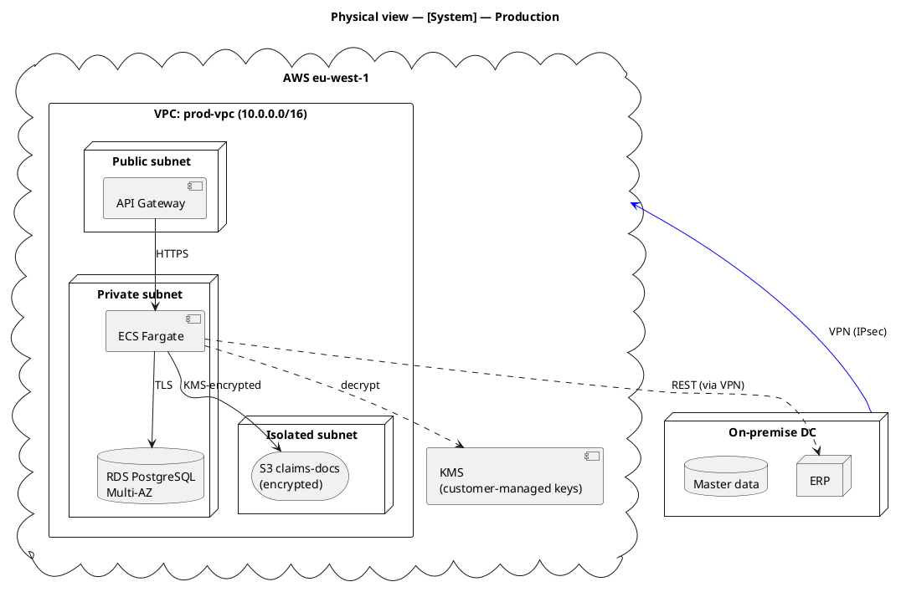
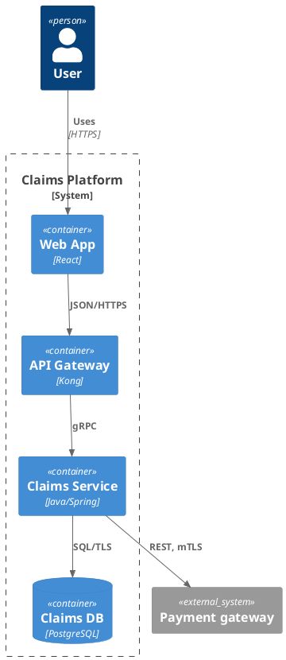
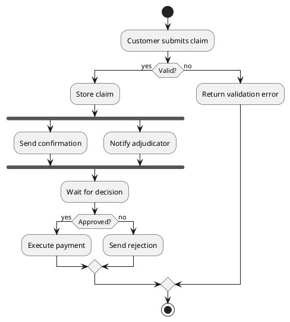

# PlantUML notation cheatsheet

PlantUML is the **primary notation for the physical view** and a fallback for logical / process views when Mermaid is insufficient. It has mature cloud-provider icon libraries and proper UML deployment semantics.

## When to use PlantUML over Mermaid

- Physical / deployment view with cloud-provider icons (AWS, Azure, GCP, Kubernetes) — PlantUML's stdlibs are far richer than Mermaid's C4Deployment.
- Detailed UML class diagrams with stereotypes, template parameters, or full relationship semantics.
- Large activity diagrams — PlantUML's activity syntax is more mature than Mermaid's.
- Any diagram where the user has explicitly asked for PlantUML output.

## Rendering

PlantUML requires a renderer. Options, from most portable to least:
1. **PlantUML online server** — `http://www.plantuml.com/plantuml/uml/<encoded>` — renders on demand, no install.
2. **Local `plantuml.jar`** — `java -jar plantuml.jar diagram.puml` — produces PNG/SVG.
3. **VS Code extension** — "PlantUML" by jebbs — live preview.
4. **IntelliJ PlantUML plugin** — ditto.
5. **GitHub** — does NOT render PlantUML natively. If the target is a GitHub repo, either (a) commit rendered `.png` / `.svg` alongside the `.puml` source, or (b) use a GitHub Action like `cloudbees-io/plantuml` to render on push.

Include this guidance in any doc you produce that references a `.puml` file.

## Essential syntax

```
@startuml
title Diagram title
skinparam backgroundColor #FFFFFF

' comment — single quote starts a comment

class Foo {
    +String publicField
    -int privateField
    +methodName() : ReturnType
}

Foo --> Bar : association label
Foo ..> Baz : dependency
Foo o-- Qux : aggregation
Foo *-- Quux : composition
Foo <|-- Child : inheritance
Foo <|.. Impl : realisation

@enduml
```

## Deployment diagram (the main thing we use PlantUML for)



## AWS icon library (recommended — looks professional)

```plantuml
@startuml
!include <awslib/AWSCommon>
!include <awslib/Groups/AWSCloud>
!include <awslib/Groups/VPC>
!include <awslib/Groups/PrivateSubnet>
!include <awslib/Groups/PublicSubnet>
!include <awslib/Compute/EC2>
!include <awslib/Containers/ElasticContainerService>
!include <awslib/Database/RDS>
!include <awslib/Storage/SimpleStorageService>
!include <awslib/NetworkingContentDelivery/APIGateway>
!include <awslib/NetworkingContentDelivery/CloudFront>
!include <awslib/NetworkingContentDelivery/Route53>
!include <awslib/SecurityIdentityCompliance/KeyManagementService>
!include <awslib/SecurityIdentityCompliance/IdentityAndAccessManagement>
!include <awslib/ManagementGovernance/CloudWatch>

title Physical view — Claims platform — Production

Route53(dns, "DNS", "claims.example.com")
CloudFront(cdn, "CDN", "static assets")

AWSCloudGroup(cloud, "AWS eu-west-1") {
    VPCGroup(vpc, "prod-vpc") {
        PublicSubnetGroup(pub, "Public subnets (a, b)") {
            APIGateway(apigw, "api-gw", "regional")
        }
        PrivateSubnetGroup(priv, "Private subnets (a, b)") {
            ElasticContainerService(ecs, "ecs-cluster", "Fargate")
            RDS(db, "claims-db", "PostgreSQL 16 Multi-AZ")
        }
        PrivateSubnetGroup(iso, "Isolated subnets") {
            SimpleStorageService(s3, "claims-docs", "SSE-KMS")
        }
    }
    KeyManagementService(kms, "KMS", "CMK")
    CloudWatch(cw, "CloudWatch", "metrics + logs")
}

dns --> cdn
cdn --> apigw
apigw --> ecs
ecs --> db
ecs --> s3
ecs ..> kms
ecs ..> cw : emit logs

@enduml
```

The stdlib reference: https://github.com/awslabs/aws-icons-for-plantuml

## Azure icon library

```plantuml
@startuml
!include <azure/AzureCommon>
!include <azure/AzureC4Integration>
!include <azure/Compute/AzureAppService>
!include <azure/Databases/AzureSQLDatabase>
!include <azure/Storage/AzureBlobStorage>
!include <azure/Security/AzureKeyVault>

AzureAppService(app, "claims-app", "App Service Plan P2v3")
AzureSQLDatabase(db, "claims-db", "Hyperscale")
AzureBlobStorage(blob, "claims-docs", "encrypted")
AzureKeyVault(kv, "claims-kv", "customer-managed keys")

app --> db
app --> blob
app ..> kv

@enduml
```

## GCP icon library

```plantuml
@startuml
!include <gcp/GCPCommon>
!include <gcp/Compute/CloudRun>
!include <gcp/Databases/CloudSQL>
!include <gcp/Storage/CloudStorage>
!include <gcp/Security/CloudKMS>

CloudRun(svc, "claims-svc", "auto-scaled")
CloudSQL(db, "claims-db", "PostgreSQL HA")
CloudStorage(gcs, "claims-docs", "CMEK encrypted")
CloudKMS(kms, "claims-keyring", "customer-managed")

svc --> db
svc --> gcs
svc ..> kms

@enduml
```

## C4-PlantUML (if the user prefers C4 semantics over pure deployment)



C4-PlantUML reference: https://github.com/plantuml-stdlib/C4-PlantUML

## Activity diagram (for detailed process modelling)



## Common mistakes

- **Forgetting `@startuml` / `@enduml`.** Without them, nothing renders.
- **Missing stdlib includes.** AWS / Azure / GCP icons require the `!include` lines at the top.
- **Hard-coded colours overriding stdlib icons.** The provider libs ship with canonical colours — don't fight them.
- **Huge monolithic diagrams.** PlantUML handles them but they become unreadable. Split by zone or environment.
- **Committing `.puml` without rendered image.** GitHub doesn't render PlantUML inline; always commit a rendered `.png` or `.svg` alongside, or set up CI to render.
