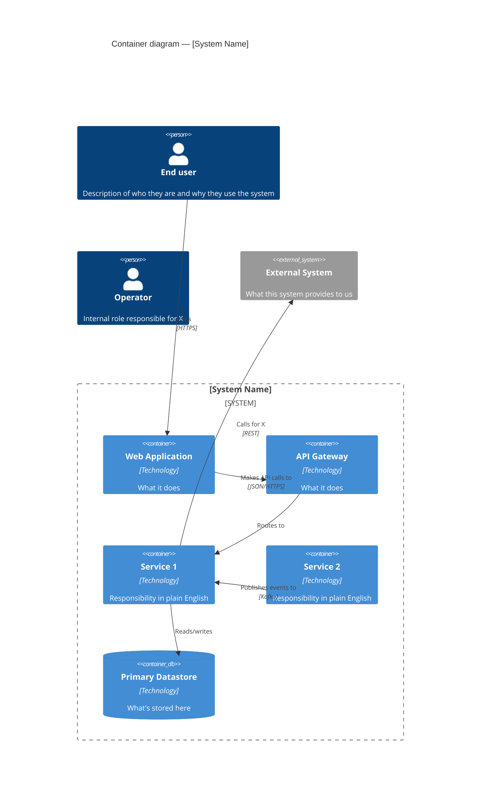

# Logical view — reference

**Purpose:** Describe the system's functional decomposition. What are the components, what does each one do, and how do they relate?

**Audience:** End-users (via analysts), business analysts, solution architects. This view answers *"what does the system do and how is it organised?"* — not *"how is it deployed"* or *"how does it behave at runtime"*.

## What belongs in the logical view

- **Components / containers** — logical groupings of functionality (services, subsystems, data stores, UI surfaces). Name them after their responsibility, not their technology. "Claims Intake Service" is better than "Spring Boot microservice #3".
- **Relationships** — synchronous calls, async events, data reads/writes, ownership.
- **Boundaries** — where does this system end? What external systems does it integrate with?
- **Interfaces** — named APIs, event topics, or data contracts that cross component boundaries.

## What does NOT belong in the logical view

- Deployment units, VPCs, containers, servers → those go in the physical view.
- Runtime sequences (who calls whom in what order) → process view.
- Source code structure, module / package layout → development view.

## Audience routing

### Audience (a) — Dev-only
Use **Mermaid class diagram** or **C4 Container diagram** (via Mermaid's `C4Context` / `C4Container`). Show:
- Each component as a class / container with a one-line description
- Relationships with directional arrows and labels (*reads from*, *publishes to*, *invokes*)
- Data stores as cylinder shapes
- External systems as separate containers on the boundary

See `references/notation-mermaid.md` → "Class diagram" and "C4 Container" sections.

### Audience (b) — Cross-functional
Use **Mermaid C4 Container diagram** at the container level — it's the most readable notation for non-developers while still being formal. Show:
- Person actors (`Person(name, "description")`)
- Each major subsystem as a container with a plain-English description of what it does
- External systems as `System_Ext`
- Relationships labelled in plain English (*"submits claim"*, *"notifies adjudicator"*)

Avoid showing internal class structures or implementation details — they're distracting at this audience level.

### Audience (c) — Executive
Use **Mermaid C4 Context diagram** only (no container-level detail). Show:
- The system as one box
- External actors (people and systems) around it
- Labelled interactions

Two sentences of prose per actor/interaction. No deeper detail.

## Structure of the logical view document

Follow `templates/view-template.md`. The logical-view-specific sections are:

1. **Audience and takeaway** — one line stating who reads this and what they should learn.
2. **System overview** — 3–5 sentences summarising the system's purpose and main functional areas.
3. **Diagram** — the Mermaid source, wrapped in a fenced code block tagged `mermaid`.
4. **Components** — one subsection per component. For each:
   - Name
   - Responsibility (1–2 sentences)
   - Key interfaces (inbound and outbound)
   - Ownership (which team / domain owns it, if known)
5. **Relationships** — a table listing each relationship with type (sync/async/data) and purpose.
6. **External dependencies** — systems the architecture depends on but does not own.
7. **Concerns** — surface any concerns from `concerns/*.md` that apply specifically to the logical organisation. For the logical view this is typically:
   - **Privacy**: does the decomposition respect data-minimisation? Is personal data concentrated in one component (good) or scattered (bad)?
   - **Security**: is there a clear trust boundary? Are authN/authZ responsibilities centralised?
   - **Bias/fairness**: if ML is present, where are the model components? Is there a dedicated fairness-evaluation component?
   - **Regulatory**: does the decomposition align with regulatory boundaries (e.g. a regulated core separate from unregulated add-ons)?
8. **Assumptions** — `> **Assumption:** …` blockquotes for anything inferred.
9. **Open questions** — architectural decisions that are still open; flag them explicitly.

## Mermaid diagram starter template (container-level, audience b)

## Common mistakes to avoid

- **Mixing abstraction levels.** Don't show "Claims Service" next to "PostgreSQL connection pool". Pick a level and stay there.
- **Tech-naming components.** "Spring Boot service" tells the reader nothing. Name after responsibility.
- **Drawing boxes with no arrows, or arrows with no labels.** Both are equally useless.
- **Showing deployment in the logical view.** That's what the physical view is for.
- **Forgetting external actors.** A logical view without the people and external systems that use the system is a half-view.
