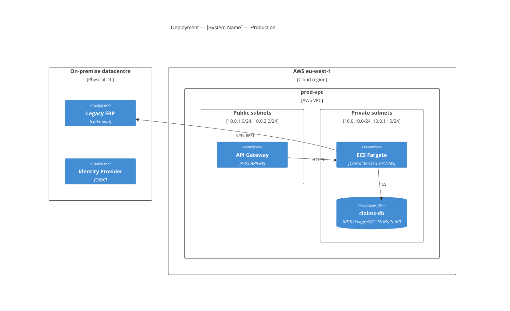

# Physical view — reference

**Purpose:** Describe where and how the system is deployed. What runs on what, where in the network, with what security posture, and how is it scaled and observed?

**Audience:** SRE / platform engineers, infrastructure engineers, security engineers, operations. This view answers *"where does this run?"*, *"how is it secured at the network level?"*, and *"how does it scale and fail over?"*

## What belongs in the physical view

- **Compute units** — VMs, containers, serverless functions, managed services
- **Network topology** — VPCs / VNets, subnets (public / private / isolated), peering, VPN, transit gateways
- **Data storage** — databases, object storage, caches, message brokers, with their specific location (region, AZ)
- **Ingress / egress** — load balancers, API gateways, CDNs, firewalls, WAFs
- **On-prem ↔ cloud links** — if hybrid: site-to-site VPN, Direct Connect, ExpressRoute
- **Observability infrastructure** — metrics, logs, traces, alerting paths
- **CI/CD pipeline infrastructure** — where builds run, where artefacts are stored, what has deploy rights
- **Security controls** — KMS / secrets manager, identity providers, audit logging destinations

## What does NOT belong in the physical view

- Functional decomposition (that's logical)
- Runtime message flows between components (that's process — though showing "component X runs on Y" is fine here)
- Code organisation (that's development)

## Notation — this view defaults to PlantUML

**PlantUML is the primary notation for the physical view**, because:
- It has mature cloud-provider stdlibs: AWS, Azure, GCP, Kubernetes, C4-PlantUML.
- Deployment diagrams with proper node / artifact semantics are native.
- Mermaid's deployment support is weaker; `C4Deployment` works but is limited.

Fall back to **Mermaid `C4Deployment`** only if:
- The user has no PlantUML renderer available
- The deployment is simple enough that the loss of detail is acceptable

See `references/notation-plantuml.md` for syntax patterns and stdlib imports.

## Audience routing

### Audience (a) — Dev-only / SRE
Full PlantUML deployment diagram with AWS/Azure/GCP stdlib. Show:
- Every VPC / subnet / security group boundary
- Every compute unit with its size / instance type if material
- Every data store with its engine and backup configuration
- Network paths including load balancers and TLS termination points
- KMS and secrets flow

### Audience (b) — Cross-functional
Simplified PlantUML deployment diagram. Show:
- Zones (on-prem / cloud), not VPC detail
- Major services grouped by function, not individual instances
- Data stores by business purpose ("Customer Data Store") not engine type
- Just the primary user-facing network path; hide internal peering and obscure detail

### Audience (c) — Executive
Use **Mermaid C4Deployment** at environment level only. Show:
- On-prem box, cloud box, their connection
- 3–5 top-level workloads in each
- No security-group or subnet detail

## Structure of the physical view document

Follow `templates/view-template.md`. Physical-view-specific sections:

1. **Audience and takeaway**
2. **Deployment environments** — list them (dev, staging, prod, DR). Note which environments this view represents; typically document prod and note any material differences for dev/staging/DR.
3. **High-level topology diagram** — PlantUML showing environments, zones, main workloads.
4. **Per-environment detail (typically prod only unless user asks otherwise):**
   - **Network topology** — PlantUML with VPCs, subnets, gateways
   - **Compute inventory** — table: component → compute type → sizing → scaling policy
   - **Data stores** — table: datastore → engine → size/tier → backup / replication
   - **Ingress / egress** — the paths traffic takes in and out
   - **CI/CD pipeline** — where builds run, how artefacts move, who can deploy what
   - **Observability** — metrics / logs / traces destinations and retention
   - **Secrets and keys** — KMS / vault provider, rotation policy, who holds master keys
5. **Non-functional properties** — availability SLA per environment, RTO/RPO, capacity headroom, cost envelope
6. **Concerns** — for the physical view:
   - **Privacy**: data residency (which region? which country?), cross-border transfer compliance, encryption at rest and in transit
   - **Security**: network segmentation, blast-radius containment, secrets management, least-privilege IAM
   - **Regulatory**: certifications required of the platform (ISO 27001, SOC 2, HIPAA, PCI-DSS), audit log immutability
   - **Sustainability**: region selection impact on carbon footprint, idle-compute review
7. **Assumptions**
8. **Open questions**

## PlantUML starter template (AWS deployment, hybrid)

```plantuml
@startuml
!include <awslib/AWSCommon>
!include <awslib/Groups/AWSCloud>
!include <awslib/Groups/VPC>
!include <awslib/Groups/PrivateSubnet>
!include <awslib/Groups/PublicSubnet>
!include <awslib/Compute/EC2>
!include <awslib/Containers/ElasticContainerService>
!include <awslib/Database/RDS>
!include <awslib/Storage/SimpleStorageService>
!include <awslib/NetworkingContentDelivery/APIGateway>
!include <awslib/SecurityIdentityCompliance/KeyManagementService>

title Physical view — [System Name] — Production

rectangle "On-premise datacentre" as onprem {
    node "Legacy ERP" as erp
    node "Identity Provider" as idp
    database "Master data" as masterdb
}

AWSCloudGroup(cloud, "AWS — eu-west-1") {
    VPCGroup(vpc, "prod-vpc (10.0.0.0/16)") {
        PublicSubnetGroup(pub, "Public subnets") {
            APIGateway(apigw, "api-gw", "public endpoint")
        }
        PrivateSubnetGroup(priv, "Private subnets") {
            ElasticContainerService(ecs, "ecs-cluster", "Fargate tasks")
            RDS(db, "claims-db", "PostgreSQL 16, Multi-AZ")
        }
        PrivateSubnetGroup(iso, "Isolated subnets") {
            SimpleStorageService(docStore, "claims-docs", "encrypted, KMS-backed")
        }
    }
    KeyManagementService(kms, "KMS", "customer-managed keys")
}

apigw --> ecs : HTTPS
ecs --> db : TLS
ecs --> docStore : KMS-encrypted PUT/GET
ecs --> kms : decrypt
ecs ..> erp : VPN, REST
ecs ..> idp : VPN, OIDC

@enduml
```

## Mermaid C4Deployment fallback starter



## Common mistakes to avoid

- **Too much detail in one diagram.** A physical view with every single security group and every IAM role is unreadable. Layer it: one topology diagram + one "zoom-in per environment" + tables.
- **Missing data residency.** For any system processing personal or regulated data, the region / country of every datastore is not optional — it's the most-asked-about property.
- **Ignoring the CI/CD path.** "How code gets to production" is part of the physical view. Skipping it leaves a hole in the threat model.
- **Treating hybrid as an afterthought.** On-prem ↔ cloud links carry the highest blast-radius and often the highest latency. Show them first-class.
- **No RTO/RPO / availability SLA.** The physical view without these numbers is decorative.
