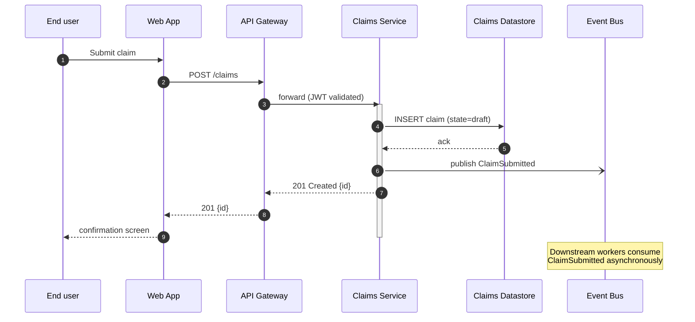
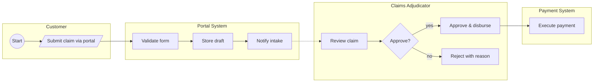

# Process view — reference

**Purpose:** Describe the system's runtime behaviour. Who calls whom, in what order, under what conditions?

**Audience:** System integrators, performance engineers, operations engineers, business analysts (for cross-functional processes). This view answers *"what happens when [event] occurs?"*

## What belongs in the process view

- **Runtime flows** — sequences of interactions between components (and human actors, if cross-functional).
- **Concurrency and ordering** — which steps run in parallel, which must be serialised.
- **Error paths** — what happens when things go wrong. At least the happy path + one failure scenario per view.
- **Timing characteristics** — latency targets, throughput targets, retry and timeout policies.
- **State transitions** — if the system has meaningful business states (draft → submitted → approved), show them.

## What does NOT belong in the process view

- Static structure (what components exist) → logical / development view.
- Where components run → physical view.
- Code organisation → development view.

## Audience routing

### Audience (a) — Dev-only
Use **Mermaid sequenceDiagram**. Show:
- Participants as named components (match the names used in the logical view exactly)
- Messages with arrow types: `->>` for sync call, `-->>` for async, `-)` for fire-and-forget
- `activate` / `deactivate` for long-running operations
- `alt` / `opt` / `loop` blocks for conditional or iterative behaviour
- `Note over X` for invariants or timing constraints

One sequence per key scenario. Don't try to fit everything into one diagram — break it up.

### Audience (b) — Cross-functional
Use **Mermaid flowchart with swimlane subgraphs**. Mermaid doesn't render true BPMN pools, but a flowchart with horizontal subgraphs approximates swimlanes well and renders everywhere. See `references/notation-bpmn-in-mermaid.md` for the exact pattern.

Show:
- One subgraph per role (human role or system role) — these become swimlanes
- Activities as rounded rectangles within the swimlanes
- Gateways as diamonds (`{like this}`)
- Events as circles (`((like this))`)
- Solid arrows for sequence flow, dashed arrows for message flow between lanes

If the process genuinely requires full BPMN (with event-subprocess, compensating transactions, message correlation), push to external BPMN tooling (bpmn.io, Camunda Modeler) and embed the resulting image. Mermaid is the 80% solution, not the 100%.

### Audience (c) — Executive
Use **Mermaid flowchart (`flowchart LR`)** at very high abstraction. Show 5–8 nodes max, each being a business-level activity. No technical detail. One diagram for the headline flow; omit error paths unless the executive specifically asked.

## Structure of the process view document

Follow `templates/view-template.md`. Process-view-specific sections:

1. **Audience and takeaway**
2. **Scope** — which processes are in this view? List them explicitly. (If too many, group into "Tier 1 — core business processes" and "Tier 2 — supporting processes", and cover Tier 1 only.)
3. **For each key process:**
   - **Process name**
   - **Trigger** — what starts this process
   - **Outcome(s)** — happy path outcome and main failure outcomes
   - **Diagram** — Mermaid source (sequence or swimlane-flowchart per audience)
   - **Step-by-step narrative** — numbered prose walkthrough of the diagram
   - **Non-functional properties** — target latency, throughput, reliability SLA
   - **Error handling** — how failures are detected and recovered
4. **Concerns** — for the process view, typically:
   - **Privacy**: where does personal data flow? Is it pseudonymised or encrypted in transit between steps?
   - **Security**: where are the trust boundaries crossed? Where is authN/authZ enforced?
   - **Bias/fairness**: if ML inference is in the flow, is there a decision point the model controls, and is that decision auditable?
   - **Auditability / regulatory**: is every significant step logged? Are logs immutable?
5. **Assumptions**
6. **Open questions**

## Mermaid sequence starter (audience a — dev)

## Mermaid swimlane-flowchart starter (audience b — cross-functional)

## Common mistakes to avoid

- **One giant diagram with every possible flow.** Break into separate diagrams per scenario. A process view with 8 focused sequence diagrams is more useful than one with 1 sprawling mess.
- **No error paths.** A happy-path-only process view hides operational reality.
- **Inconsistent participant names.** Participants in the process view must match component names in the logical view exactly. "Claims Service" in one view and "Claim Mgr" in another will cause confusion.
- **Skipping the narrative.** A diagram without a numbered walkthrough is only half the deliverable.
- **Forgetting timing.** Process views without latency / throughput targets are missing the point — that's half what the view is for.
