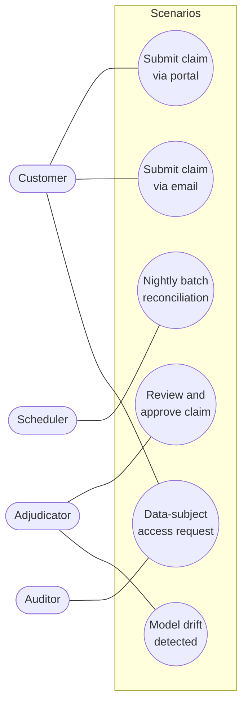
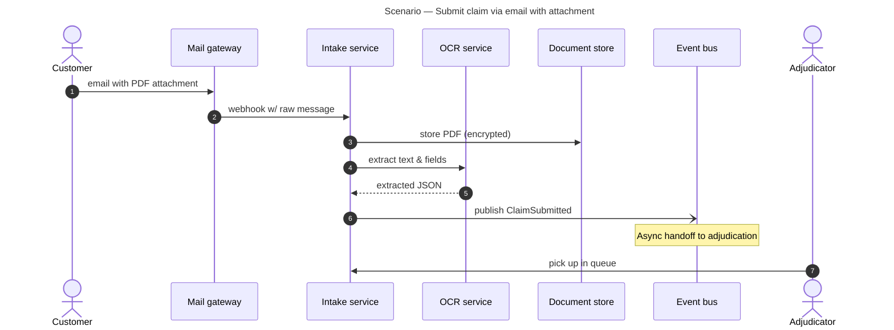

# Scenarios (+1) view — reference

**Purpose:** Validate the other four views by walking through concrete, meaningful use cases. Show how actors and components from the logical view behave in the process view, are organised in the development view, and are deployed in the physical view.

**Audience:** All stakeholders. The scenarios view is the unifying view — it's the one you hand someone to understand *"how does this actually work?"* without having to cross-reference four other documents.

## What belongs in the scenarios view

- **Use cases** — concrete named scenarios that are meaningful to the business.
- **For each scenario:** which actors are involved, which components, which deployment zones, and the sequence of interactions.
- **Coverage mapping** — a table showing which components / processes each scenario exercises. Good coverage means every major component in the logical view appears in at least one scenario.

## Picking which scenarios to document

Aim for **4–7 scenarios**. Pick them so the set collectively exercises:
- Every major component in the logical view
- Every main process path in the process view
- Every deployment zone in the physical view
- The main failure / error recovery paths

Scenarios typically fall into categories:
- **Happy path** — the core business outcome (usually 1–2 of these)
- **Edge case** — unusual but valid input / timing (1–2)
- **Failure** — a component fails, a dependency is unavailable, bad input (1–2)
- **Operational** — a deployment, a key rotation, a DR failover (1)
- **Regulatory / audit** — a compliance-triggered flow (where relevant, 1)

## Audience routing

### Audience (a) — Dev-only
Use **Mermaid sequenceDiagram** per scenario (same pattern as the process view but scoped to one concrete scenario). Add a short UML-style **use-case diagram** at the top showing actors and scenario names as ovals.

### Audience (b) — Cross-functional
Use **Mermaid flowchart** per scenario (swimlane style, like the process view), OR a simple stepwise prose narrative with a small diagram per step. Add a summary table of scenarios and actors.

### Audience (c) — Executive
Prose-only narrative of 3–5 scenarios, each 2–4 sentences. Optionally one high-level diagram showing the scenarios as a single overview.

## Structure of the scenarios view document

Follow `templates/view-template.md`. Scenarios-view-specific sections:

1. **Audience and takeaway**
2. **Actor catalogue** — every human or system actor that appears in any scenario. One line each describing their role.
3. **Use-case overview diagram** — Mermaid flowchart with actors and their scenarios as ovals (use-case style). Shows the scope of what's covered.
4. **Scenarios** — one subsection per scenario. For each:
   - **Scenario name** (short, memorable — e.g. *"Claim submitted via email with attachment"*)
   - **Category** — happy / edge / failure / operational / regulatory
   - **Trigger** — what initiates it
   - **Actors involved**
   - **Preconditions**
   - **Diagram** — Mermaid (sequence or swimlane-flowchart per audience)
   - **Step-by-step narrative**
   - **Postconditions** — success and / or failure outcomes
   - **Views exercised** — which logical / process / development / physical elements this scenario touches
5. **Coverage matrix** — table with rows = components (from logical view) and columns = scenarios. Put ✓ in each cell where the scenario exercises that component. Empty rows indicate components no scenario covers (fix: add a scenario, or confirm the component is truly orthogonal).
6. **Concerns** — for scenarios:
   - **Privacy**: does at least one scenario cover data-subject-rights handling (GDPR Art. 15/17/20)?
   - **Security**: does at least one scenario cover an attack path (credential compromise, injection, insider threat)?
   - **Bias/fairness**: if ML is present, does a scenario cover what happens when the model is uncertain or wrong?
   - **Regulatory**: does a scenario cover audit-trail reconstruction (how would we prove to a regulator what happened)?
7. **Assumptions**
8. **Open questions**

## Mermaid use-case overview starter

## Mermaid scenario-sequence starter

## Coverage matrix example

| Component (from logical view) | S1 Submit-portal | S2 Submit-email | S3 Review-approve | S4 Nightly-batch | S5 DSAR | S6 Model-drift |
|------------------------------|:----------------:|:----------------:|:------------------:|:-----------------:|:-------:|:---------------:|
| Web portal                    | ✓                |                  |                    |                   | ✓       |                 |
| Mail gateway                  |                  | ✓                |                    |                   |         |                 |
| Intake service                | ✓                | ✓                |                    | ✓                 |         |                 |
| OCR service                   |                  | ✓                |                    |                   |         |                 |
| Claims datastore              | ✓                | ✓                | ✓                  | ✓                 | ✓       |                 |
| Adjudication UI               |                  |                  | ✓                  |                   |         | ✓               |
| ML classifier                 | ✓                | ✓                |                    |                   |         | ✓               |
| Audit log                     | ✓                | ✓                | ✓                  | ✓                 | ✓       | ✓               |

## Common mistakes to avoid

- **Too many scenarios.** 4–7 is the sweet spot. More than 10 and the view loses its "unifying" purpose.
- **Only happy paths.** A scenarios view with no failure / edge / operational cases hides the interesting architectural decisions.
- **Diagrams without narrative.** The narrative is what makes scenarios useful to non-technical readers.
- **No coverage matrix.** Without it, you can't tell whether the scenarios actually exercise the architecture, or just a slice of it.
- **Names that don't travel.** "Scenario 1" is useless. "Claim-submitted-via-email" is memorable and self-documenting.
